# Phase 0 - Hardware Acquisition and Pre-Build Setup
## PolkTech SOHO Active Directory Homelab

---

## Objective

Source, inspect, and prepare the physical hardware that will serve as the Proxmox VE hypervisor host for the PolkTech homelab. This phase covers hardware acquisition, refurbishment, component installation, and pre-build verification before any software is installed.

---

## Environment

| Component | Details |
|---|---|
| Host | Dell OptiPlex 3080 SFF |
| Source | PCs for People (refurbished) |
| CPU | Intel Core i5-10500 SRH3A 3.10GHz |
| RAM | Samsung 8GB 1Rx8 PC4-2666V, SK Hynix 8GB 1Rx8 PC4-2666V (16GB total) |
| Storage | Western Digital PC SN520 NVMe 256GB |
| Onboard NIC | Realtek RTL8111 1G |
| Added PCIe NIC | Intel 82576 Gigabit dual-port PCIe X1 |
| PSU | Dell 200W (H200EBS-01) |

---

## Tools and Technologies

- Compressed air for exterior and interior cleaning
- Thermal Grizzly Kryonaut thermal paste
- Isopropyl alcohol for CPU and socket cleaning
- Phillips screwdriver
- Intel 82576 dual-port PCIe NIC (82576-GE-2T-X1)

---

## Why This Hardware

The Dell OptiPlex 3080 SFF was chosen as the Proxmox host because it is a cost-effective business-class desktop with enough CPU, RAM, storage, and expansion capability for a small Active Directory homelab.

Key reasons for using this system:

- **Cost-effective:** sourced as a refurbished unit from PCs for People, a nonprofit that refurbishes donated computers
- **Enterprise-grade:** the OptiPlex line is Dell's commercial desktop platform, built for reliability and long-term business use
- **10th-generation Intel CPU:** the i5-10500 supports Intel VT-x and VT-d, which are important for virtualization
- **PCIe expansion slot:** the SFF form factor includes a PCIe X1 slot, allowing an additional dual-port NIC to be installed for network segmentation

Using refurbished hardware also made the setup more realistic. Many small businesses reuse older business-class systems or purchase refurbished equipment instead of buying new hardware for every need. Before installing Proxmox, I inspected the system, reviewed the internal components, and confirmed that the machine was suitable for virtualization. This connects directly to desktop support and IT asset management work.

---

## Hardware Acquisition

The OptiPlex 3080 was sourced from **PCs for People**, a nonprofit organization that refurbishes donated computers and resells them at low cost to individuals and organizations. The machine was tested and certified for full functionality prior to sale.

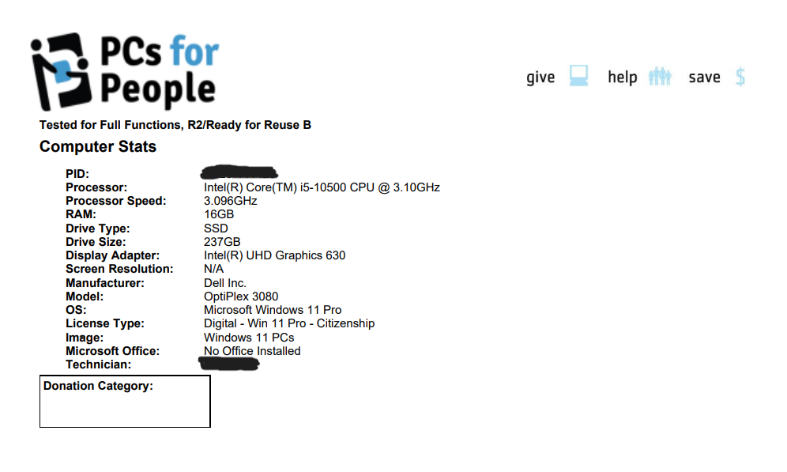
*PCs for People hardware specification sheet confirming machine model, CPU, RAM, and storage*

The unit was received with:

- Intel Core i5-10500 CPU installed
- 16GB DDR4 RAM installed (Samsung 8GB + SK Hynix 8GB)
- Western Digital PC SN520 NVMe 256GB installed
- Windows 11 Pro pre-installed (wiped during Proxmox installation)
- No PCIe expansion card installed

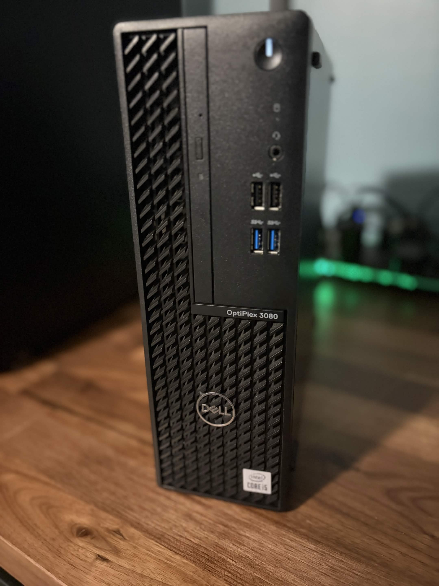
*Dell OptiPlex 3080 SFF Proxmox VE host for the PolkTech homelab*

---

## Network Design

Before any hardware work began, the target network design was mapped out to confirm the hardware requirements. The planned design required a dedicated path for Proxmox management, a separate WAN uplink for OPNsense, and internal-only lab networks for server and workstation traffic.

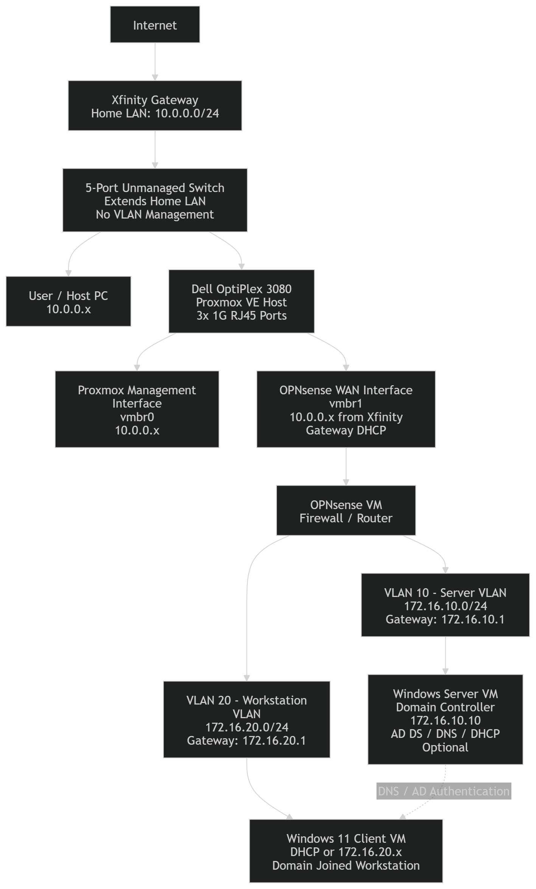
*Planned PolkTech lab network: OPNsense VM separates the home LAN from the lab VLANs*

---

## Hardware Inspection and Cleaning

The exterior was cleaned using compressed air to remove dust buildup before opening the case. The internal components were then inspected before any work began.

The RAM was removed prior to inspection photography to allow better visibility of the motherboard and PCIe slot.

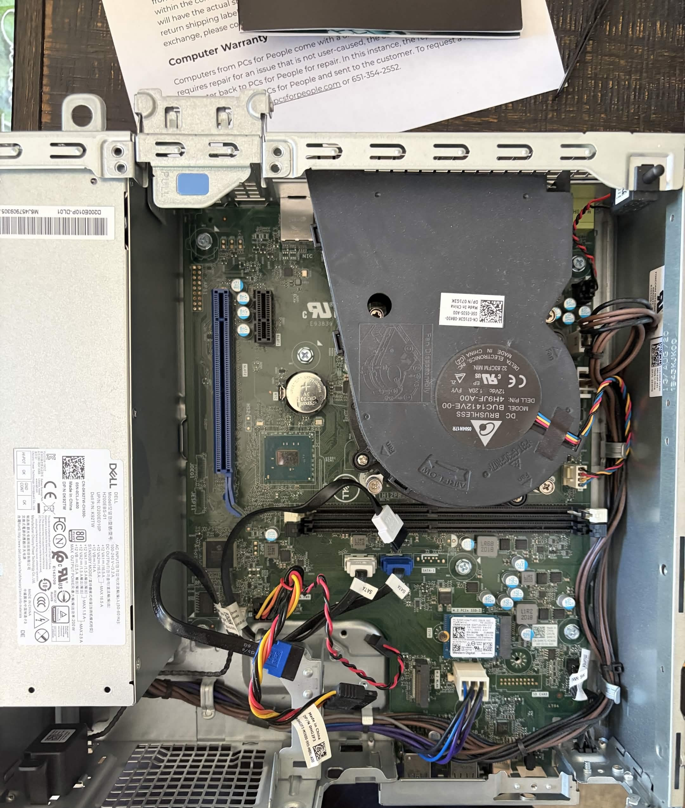
*Dell OptiPlex 3080 interior: RAM temporarily removed for inspection, PCIe slot empty*

The CPU socket was inspected and found to have old dried thermal paste residue and dust buildup from the previous owner. This is common on refurbished machines and requires cleaning before reinstalling the CPU cooler.

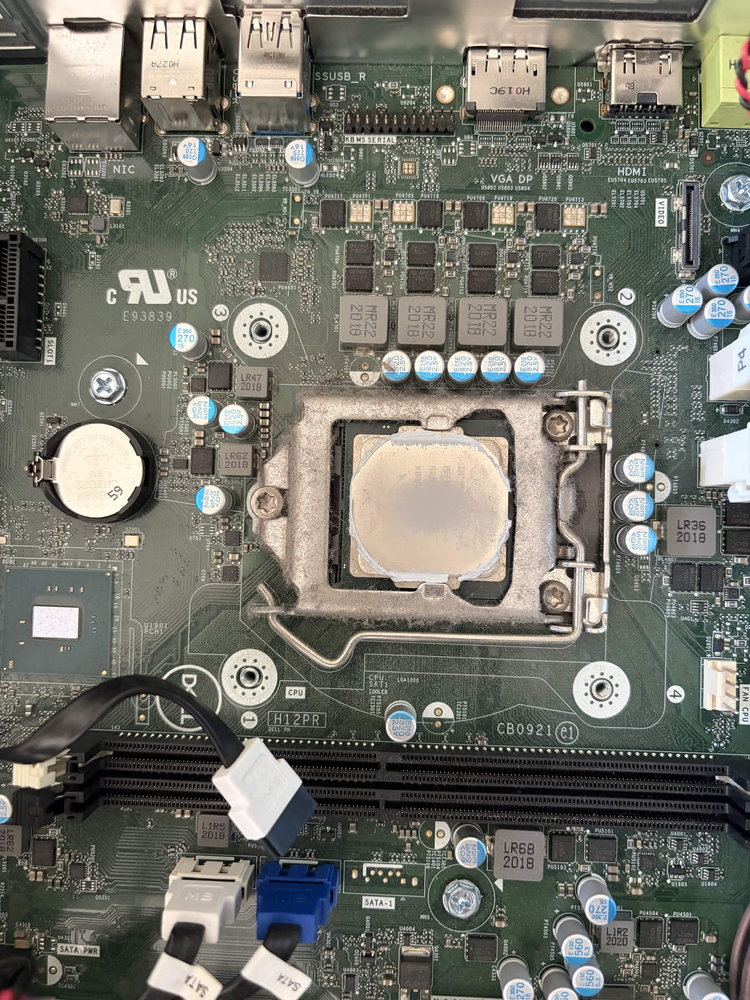
*CPU socket as received: old thermal paste residue and dust buildup requiring cleaning*

---

## RAM Verification

Both RAM sticks were removed and inspected to verify the part numbers and specifications before reinstalling.

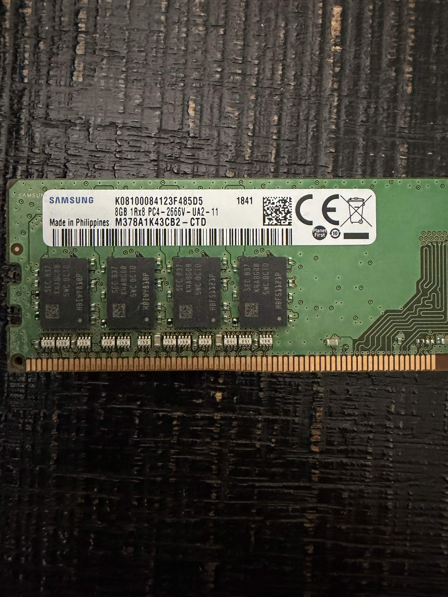
*Samsung 8GB 1Rx8 PC4-2666V-UA2-11 DDR4 module, one of two sticks making up the 16GB total*

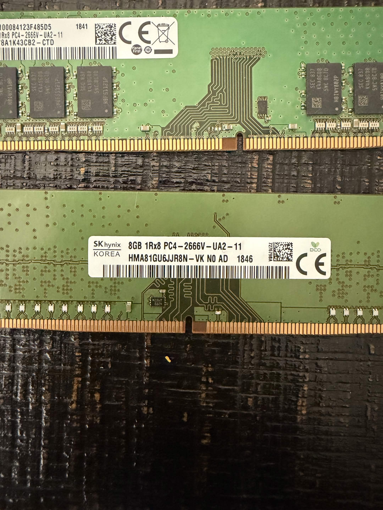
*SK Hynix 8GB 1Rx8 PC4-2666V-UA2-11 DDR4 module, the second of two sticks making up the 16GB total*

Both sticks are DDR4-2666 running in dual channel configuration for a total of 16GB.

---

## CPU Cleaning and Thermal Paste Application

The CPU and socket were cleaned using isopropyl alcohol to remove the old thermal paste residue. Fresh **Thermal Grizzly Kryonaut** thermal paste was then applied in an X pattern on the CPU IHS (integrated heat spreader) before reinstalling the cooler.

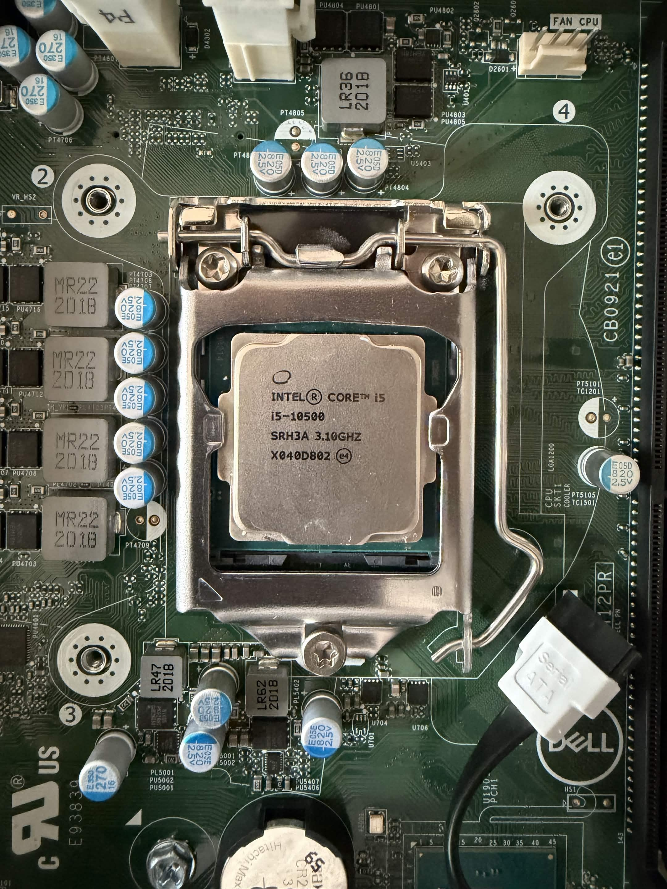
*Intel Core i5-10500 installed in LGA1200 socket after cleaning*

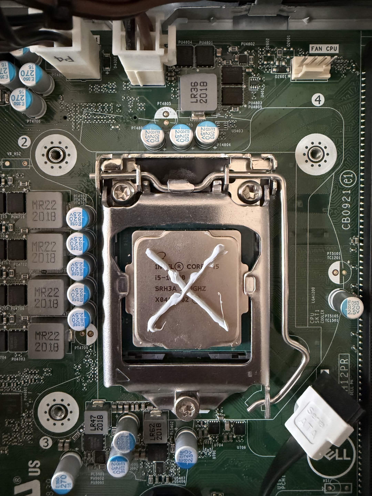
*Thermal Grizzly Kryonaut applied to i5-10500 prior to cooler installation*

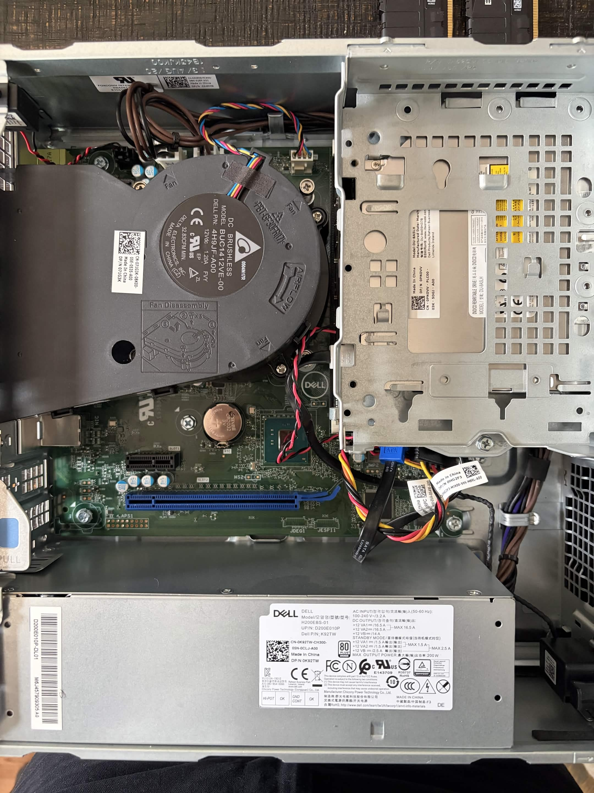
*CPU cooler reinstalled after thermal paste application; PCIe X1 slot visible in the lower portion of the frame*

---

## NVMe Storage Verification

The Western Digital PC SN520 NVMe SSD was verified as installed and recognized in the M.2 PCIe slot on the motherboard. This drive serves as the sole storage device for Proxmox VE and all lab VMs.

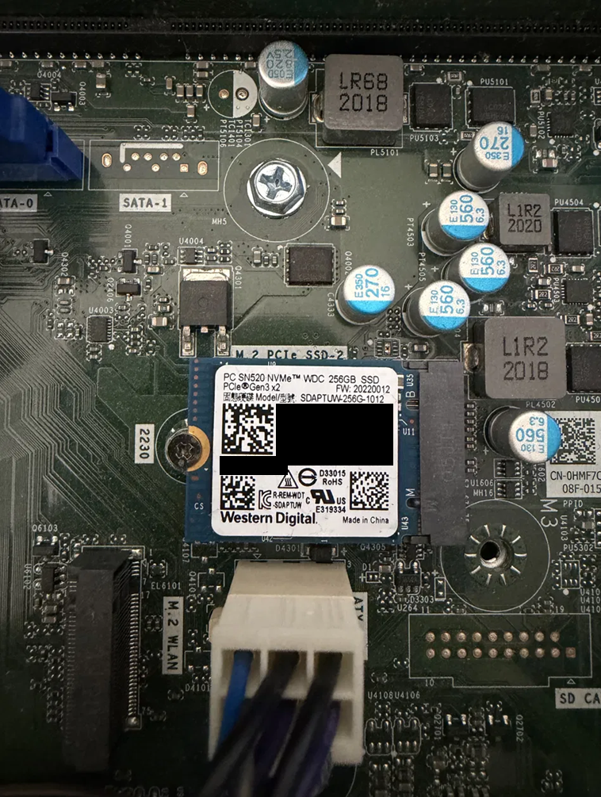
*WD PC SN520 NVMe 256GB installed in the M.2 PCIe slot*

---

## PCIe NIC Installation

The OptiPlex 3080 ships with a single onboard Realtek RTL8111 NIC. For this lab, a second NIC was required to properly segment the lab environment from the home network.

The core problem is that the home network router runs its own DHCP server. Without network segmentation, lab VMs would connect directly to the home network and receive IP addresses from the home router. That would mix lab traffic with personal home network traffic and make it harder to control DHCP, DNS, firewall rules, and routing for the lab.

To solve this, an **Intel 82576 dual-port 1G PCIe X1 NIC** was purchased and installed. This gives the OptiPlex three physical network ports:

- **Onboard Realtek:** Proxmox management interface, connected to the home network
- **Intel 82576, ACT/LNK B (nic1):** dedicated OPNsense WAN uplink; passes home network traffic only to OPNsense
- **Intel 82576, ACT/LNK A (nic2):** spare, reserved for future use

> Physical port mapping note: Proxmox maps nic1 to the physical port labeled **ACT/LNK B** and nic2 to **ACT/LNK A**. This was verified during Phase 2 when the WAN cable initially had no link. The WAN uplink cable must be connected to **ACT/LNK B**.

All lab VMs connect to internal virtual bridges inside Proxmox and route through OPNsense. This means the home router never sees lab VM traffic and never assigns IP addresses to lab VMs. The lab network remains isolated from the home network.

The Intel 82576 chipset was chosen because it has mature, reliable driver support in Linux and Proxmox VE environments.

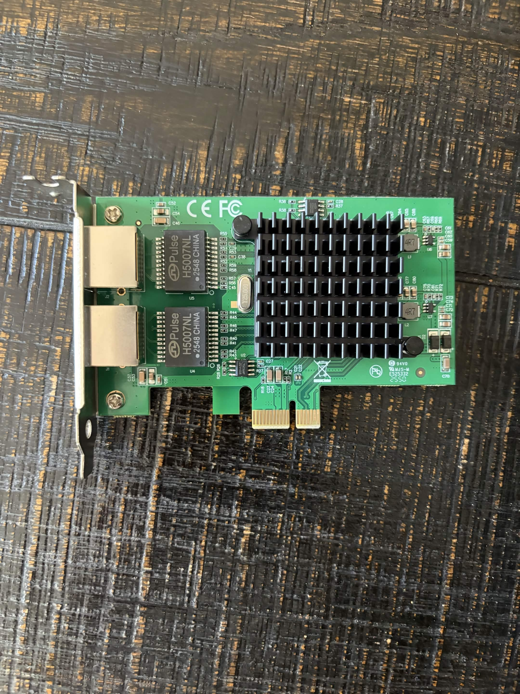
*Intel 82576 dual-port 1G PCIe X1 NIC before installation, providing dedicated WAN and spare network interfaces*

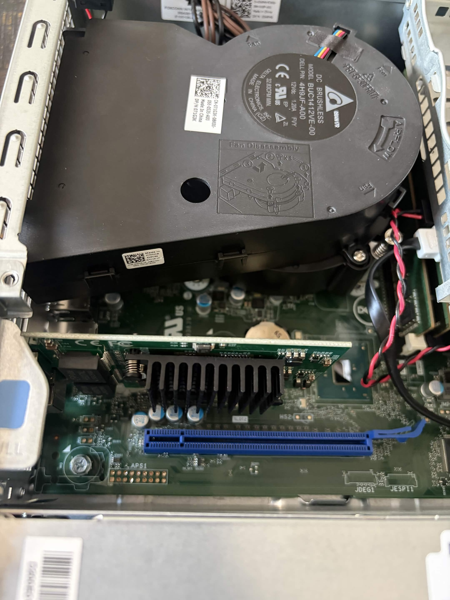
*Intel 82576 NIC installed in the PCIe X1 slot*

After installation, the rear I/O panel shows all three RJ45 ports: the onboard Realtek port and the two Intel 82576 ports labeled ACT/LNK A and ACT/LNK B.

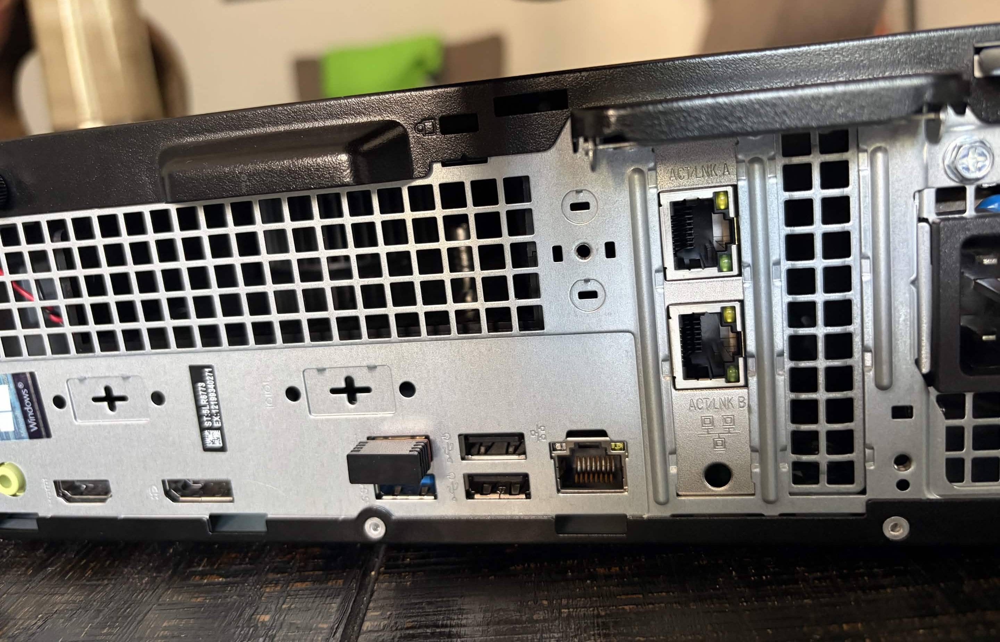
*Rear I/O panel: onboard Realtek NIC at the bottom and Intel 82576 dual-port PCIe NIC at the top, labeled ACT/LNK A and ACT/LNK B*

---

## Validation

With all hardware installed and verified, the machine was booted from the Proxmox VE USB installer to confirm the hardware was recognized and ready for installation.

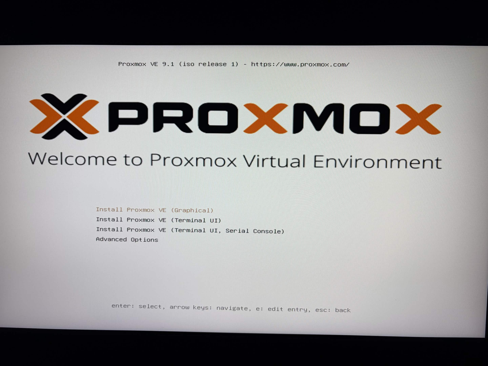
*Proxmox VE 9.1.1 installer boot menu confirming successful boot from USB installation media*

---

## Final Hardware Summary

| Component | Details | Status |
|---|---|---|
| CPU | Intel Core i5-10500 3.10GHz | Cleaned and reseated |
| RAM | 16GB DDR4 (Samsung 8GB + SK Hynix 8GB) | Verified and reinstalled |
| Storage | WD PC SN520 NVMe 256GB | Verified installed |
| Onboard NIC | Realtek RTL8111 1G | Verified present |
| PCIe NIC | Intel 82576 dual-port 1G PCIe X1 | Installed |
| PSU | Dell 200W H200EBS-01 | Verified present |
| Thermal paste | Thermal Grizzly Kryonaut | Applied |
| Exterior cleaning | Compressed air | Completed |

---

## Troubleshooting Notes

**Observation:** Old thermal paste residue and dust found on CPU socket and CPU IHS

**Resolution:** Cleaned CPU and socket with isopropyl alcohol before applying fresh Thermal Grizzly Kryonaut. This is standard practice when refurbishing or reusing hardware from a previous owner and ensures proper thermal contact between the CPU and cooler.

---

## What I Learned

- Refurbished enterprise hardware requires inspection and cleaning before deployment; it cannot be assumed to be in good condition just because it powers on
- Thermal paste dries out over time and should be replaced when reseating a cooler or inheriting used hardware
- Adding a secondary NIC is necessary when running a virtual firewall inside a hypervisor because it helps separate management traffic from routed lab VM traffic
- The PCIe expansion slot in the OptiPlex 3080 SFF accommodates a low-profile PCIe X1 card, which is sufficient for a dual-port 1G NIC
- Hardware documentation with photos is a standard practice in IT asset management and helps establish a clear record of what is installed and why

---

## Real-World IT Relevance

Hardware inspection, refurbishment, and component installation are core desktop support and IT technician skills. In a real business environment, IT staff regularly receive refurbished or second-hand machines that require cleaning, component verification, RAM or storage upgrades, and documentation before deployment.

Understanding why network segmentation requires dedicated physical NICs, and being able to plan that at the hardware level before software is installed, applies directly to virtualization administrator and junior systems administrator roles.

---

## Future Improvements

- Add a second NVMe drive for additional VM storage if the 256GB drive becomes a limiting factor
- Consider a RAM upgrade to 32GB if additional VMs are added in future phases

---

## Next Phase

[Phase 1 - Proxmox VE Installation and Network Configuration](../phase-1-proxmox/)
