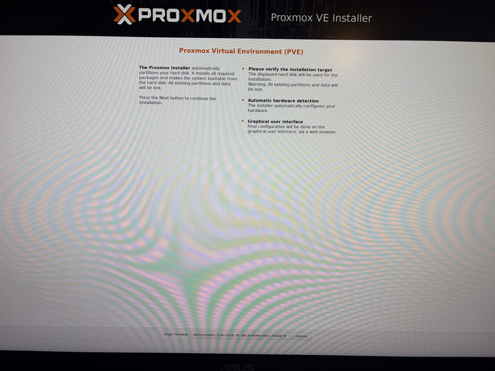
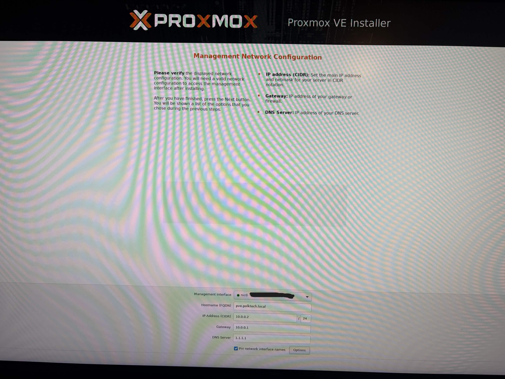
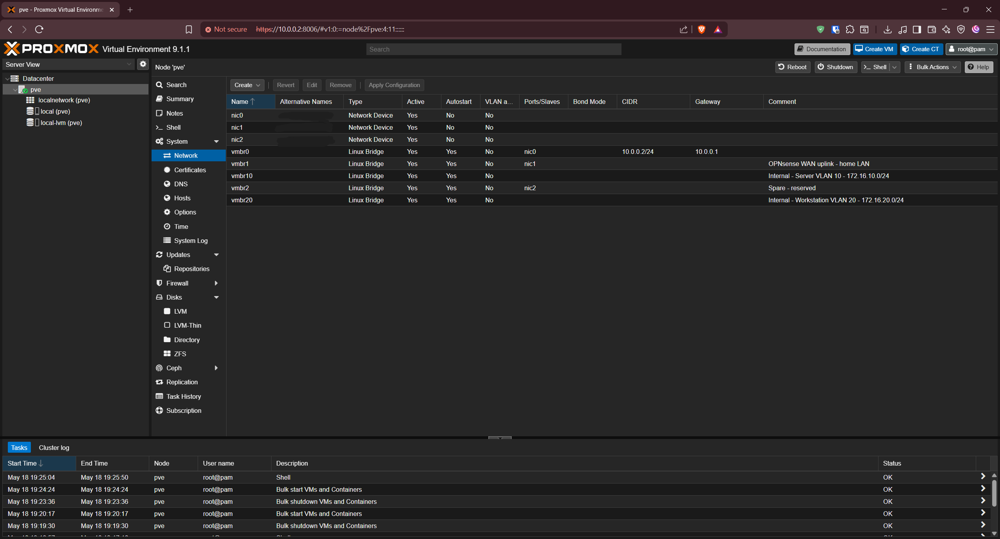
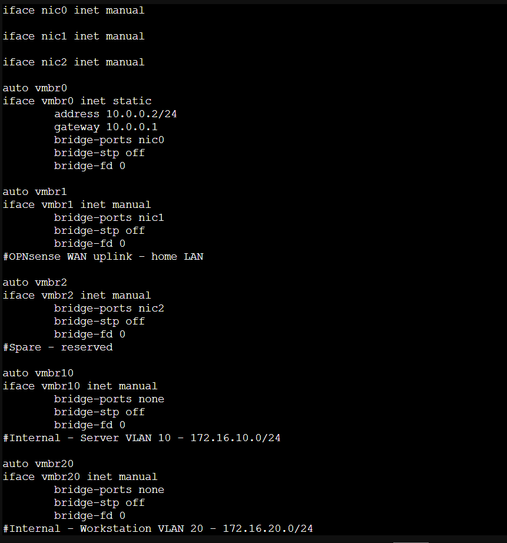

# Phase 1 - Proxmox VE Installation and Network Configuration
## PolkTech SOHO Active Directory Homelab

---

## Objective

Install Proxmox VE on the Dell OptiPlex 3080 and configure the virtual network bridges that will support all lab VMs. This phase establishes the hypervisor foundation that every later phase builds on.

---

## Environment

| Component | Details |
|---|---|
| Host | Dell OptiPlex 3080 SFF |
| CPU | Intel Core i5-10500 3.10GHz |
| RAM | 16GB DDR4 (Samsung 8GB + SKhynix 8GB) |
| Storage | Western Digital PC SN520 NVMe 256GB |
| Onboard NIC | Realtek RTL8111 (nic0) |
| PCIe NIC | Intel 82576 Gigabit dual-port PCIe X1 (nic1, nic2) |
| Hypervisor | Proxmox VE 9.1.1 |
| Home LAN | 10.0.0.0/24 (Xfinity Gateway) |

> Naming note: the Proxmox host uses `pve.polktech.local`. The Active Directory domain planned for later phases is `corp.polktech.local`.

---

## Tools and Technologies

- Proxmox VE 9.1.1
- Linux bridges (vmbr0, vmbr1, vmbr2, vmbr10, vmbr20)
- `/etc/network/interfaces` (Debian network configuration)
- `ip link` and `lspci` for NIC identification

---

## Network Design

The OptiPlex has three physical NIC ports mapped to five Proxmox Linux bridges:

| Bridge | Physical NIC | Role | IP |
|---|---|---|---|
| vmbr0 | nic0 (Realtek RTL8111, onboard) | Proxmox management | 10.0.0.2/24 |
| vmbr1 | nic1 (Intel 82576, ACT/LNK B) | OPNsense WAN uplink | None |
| vmbr2 | nic2 (Intel 82576, ACT/LNK A) | Spare, reserved | None |
| vmbr10 | None (internal) | Server VLAN 10 | None |
| vmbr20 | None (internal) | Workstation VLAN 20 | None |

Physical port mapping note: nic1 maps to the bracket port labeled **ACT/LNK B**, and nic2 maps to **ACT/LNK A**. This is the reverse of what the physical bracket order may suggest. The WAN uplink cable must go to **ACT/LNK B**.

`vmbr10` and `vmbr20` are internal-only bridges with no physical NIC attached. Lab VMs connect to these bridges, and all lab traffic routes through the OPNsense VM. This design ensures lab VMs cannot reach the home LAN directly and cannot receive DHCP from the Xfinity Gateway.

---

## Installation Steps

### Step 1 - Prepare installation media

Downloaded the Proxmox VE ISO and flashed it to a USB drive using Rufus.

### Step 2 - Boot from USB

Powered on the OptiPlex and pressed F12 at the Dell logo to access the boot menu. Selected the USB drive to boot into the Proxmox installer.

### Step 3 - Select installation disk

Selected `/dev/nvme0n1` (WD PC SN520 NVMe 256GB) as the target disk. Filesystem left as default `ext4`.

> Screenshot captured on phone during physical bare metal installation. Proxmox VE does not provide a screenshot utility during the installer process.


*Proxmox installer disk selection showing `/dev/nvme0n1` selected as the target disk*

### Step 4 - Configure management network

Entered the following values on the Management Network Configuration screen:

| Setting | Value |
|---|---|
| Management Interface | nic0 (Realtek RTL8111) |
| Hostname (FQDN) | pve.polktech.local |
| IP Address (CIDR) | 10.0.0.2/24 |
| Gateway | 10.0.0.1 |
| DNS Server | 1.1.1.1 (Cloudflare) |

> MAC address redacted from screenshot.


*Proxmox installer management network configuration for `pve.polktech.local`*

### Step 5 - Complete installation

Confirmed the settings and proceeded with installation. Proxmox rebooted automatically after completion.

### Step 6 - Identify physical NICs

After installation, logged into the Proxmox shell and ran the following commands to identify NIC device names:

```bash
ip link show
lspci | grep -i ethernet
```

Output confirmed three physical interfaces:

| Linux Name | Hardware | Role |
|---|---|---|
| nic0 | Realtek RTL8111 (onboard) | Proxmox management |
| nic1 | Intel 82576, ACT/LNK B | OPNsense WAN |
| nic2 | Intel 82576, ACT/LNK A | Spare |

A fourth interface (nic3) appeared initially due to a WiFi USB adapter. The adapter was removed and nic3 cleared automatically.

### Step 7 - Create Linux bridges

Logged into the Proxmox web UI at `https://10.0.0.2:8006` and navigated to:

**Datacenter > pve > Network > Create > Linux Bridge**

Created the following bridges:

**vmbr1 - OPNsense WAN uplink**

- Bridge ports: `nic1`
- No IP address
- Comment: `OPNsense WAN uplink - home LAN`

**vmbr2 - Spare**

- Bridge ports: `nic2`
- No IP address
- Comment: `Spare - reserved`

**vmbr10 - Internal Server VLAN**

- Bridge ports: none
- No IP address
- Comment: `Internal - Server VLAN 10 - 172.16.10.0/24`

**vmbr20 - Internal Workstation VLAN**

- Bridge ports: none
- No IP address
- Comment: `Internal - Workstation VLAN 20 - 172.16.20.0/24`

Clicked **Apply Configuration** to activate all bridges.


*Proxmox network tab showing vmbr0, vmbr1, vmbr2, vmbr10, and vmbr20 configured*

---

## Validation

Verified the bridge configuration by running the following in the Proxmox shell:

```bash
cat /etc/network/interfaces
```


*Output of `cat /etc/network/interfaces` confirming all five bridges are correctly configured*

Confirmed all five bridges were correctly configured. Then verified internet connectivity from the Proxmox host:

```bash
ping -c 4 1.1.1.1
```

```text
PING 1.1.1.1 (1.1.1.1) 56(84) bytes of data.
64 bytes from 1.1.1.1: icmp_seq=1 ttl=54 time=21.2 ms
64 bytes from 1.1.1.1: icmp_seq=2 ttl=54 time=18.2 ms
64 bytes from 1.1.1.1: icmp_seq=3 ttl=54 time=18.5 ms
64 bytes from 1.1.1.1: icmp_seq=4 ttl=54 time=20.0 ms
--- 1.1.1.1 ping statistics ---
4 packets transmitted, 4 received, 0% packet loss, time 3005ms
```

**All validation checks passed:**

- [x] Proxmox web UI accessible at `https://10.0.0.2:8006`
- [x] vmbr0 shows 10.0.0.2/24 with gateway 10.0.0.1
- [x] vmbr1 and vmbr2 have no IP address
- [x] vmbr10 and vmbr20 are internal bridges with no physical NIC
- [x] Proxmox internet connectivity confirmed with 0% packet loss

---

## Troubleshooting Notes

**Problem:** Unexpected fourth NIC (nic3) appearing in the web UI

**Cause:** A WiFi USB adapter was plugged into the host during installation, creating an unneeded network interface.

**Resolution:** Removed the WiFi USB adapter from the host, then removed the ghost nic3 entry from the Proxmox web UI using the Network tab Remove button. The interface list correctly showed only nic0, nic1, and nic2 after removal.

**Problem:** Realtek RTL8111 onboard NIC not previously documented in hardware inventory

**Resolution:** Identified via `lspci` output. Hardware inventory updated to reflect both the onboard Realtek NIC and the Intel 82576 PCIe add-in card.

---

## What I Learned

- Proxmox VE uses Linux bridges to connect VMs to physical and virtual networks, similar in concept to virtual switches in VMware vSphere
- Physical NICs should be identified by name before configuring bridges to avoid incorrect assignments
- Internal bridges with no physical NIC attached are a clean way to create isolated lab segments that never touch the home LAN
- The `lspci` command is useful for identifying hardware that may not be labeled or documented
- Separating management traffic (vmbr0) from VM traffic (vmbr1, vmbr10, vmbr20) is a standard practice in virtualization environments

---

## Real-World IT Relevance

In enterprise environments, hypervisor network configuration is a foundational skill for systems administrators and virtualization engineers. Mapping physical NICs to virtual switches, isolating management traffic, and designing internal-only networks are standard practices in VMware vSphere, Microsoft Hyper-V, and Proxmox VE deployments.

This phase mirrors the kind of work a junior systems administrator would perform when provisioning a new virtualization host: documenting the hardware, planning the network before making changes, and validating the configuration before moving on.

---

## Future Improvements

- Configure a static DHCP reservation for OPNsense WAN on the Xfinity Gateway when the home LAN is reconfigured
- Add VLAN 30 (IT/Admin) and VLAN 99 (Lab Management) bridges in a future phase if needed
- Consider adding a second NVMe or SSD for additional VM storage capacity

---

## Next Phase

[Phase 2 - OPNsense VM Installation and Configuration](../phase-2-opnsense/)
