# Phase 2 - OPNsense VM Installation and Configuration
## PolkTech SOHO Active Directory Homelab

---

## Objective

Create and configure the OPNsense virtual firewall and router on the Proxmox hypervisor. OPNsense (PT-OPNSENSE-01) serves as the network boundary between the home LAN and the lab's internal VLANs. It provides routing, DHCP, DNS forwarding, and firewall enforcement for the Server VLAN (VLAN 10) and the Workstation VLAN (VLAN 20).

---

## Environment

| Component | Details |
|---|---|
| Host | Dell OptiPlex 3080 SFF |
| Hypervisor | Proxmox VE 9.1.1 |
| VM Name | PT-OPNSENSE-01 (VM ID 100) |
| OS | OPNsense 26.1.6_2 (amd64) / FreeBSD 14.3-RELEASE-p10 |
| VM Resources | 2 cores (kvm64), 2GB RAM, 16GB disk |
| WAN | 10.0.0.8/24 via DHCP from Xfinity Gateway |
| LAN (VLAN 10) | 172.16.10.1/24 static |
| OPT1 (VLAN 20) | 172.16.20.1/24 static |

---

## Tools and Technologies

- OPNsense 26.1.6_2
- Proxmox VE VM creation wizard
- VirtIO network drivers (vtnet0, vtnet1, vtnet2)
- Dnsmasq DNS and DHCP service (temporary; migrates to Windows Server in Phase 3)
- OPNsense setup wizard and web UI
- `pfctl` for temporary packet filter control
- `ethtool` and `ip link` for NIC diagnostics from the Proxmox shell
- Windows PowerShell `route add` for temporary web UI access

---

## Network Design

| Interface | VirtIO Device | Bridge | Subnet | Gateway IP |
|---|---|---|---|---|
| WAN | vtnet0 | vmbr1 | 10.0.0.x (DHCP from Xfinity) | 10.0.0.1 |
| LAN / VLAN 10 | vtnet1 | vmbr10 | 172.16.10.0/24 | 172.16.10.1 |
| OPT1 / VLAN 20 | vtnet2 | vmbr20 | 172.16.20.0/24 | 172.16.20.1 |

`vmbr10` and `vmbr20` are the internal-only bridges established in Phase 1. All lab VM traffic routes through OPNsense. Lab VMs cannot reach the home LAN directly and cannot receive DHCP from the Xfinity Gateway.

---

## Critical NIC Port Finding

Before creating the VM, physical WAN port mapping was confirmed. The Intel 82576 PCIe card's bracket labels are opposite of what Proxmox assigns:

| Proxmox NIC | Physical Port on Bracket | Role |
|---|---|---|
| nic1 | ACT/LNK **B** (right port) | OPNsense WAN uplink |
| nic2 | ACT/LNK **A** (left port) | Reserved / spare |

> The WAN Ethernet cable from the Xfinity Gateway must be plugged into **ACT/LNK B**, not ACT/LNK A. Plugging into the wrong port will result in WAN receiving no DHCP address.

---

## Installation Steps

### Step 1 - Download and upload OPNsense ISO

Downloaded the OPNsense 26.1.6 DVD installer ISO from the official OPNsense website. Uploaded it to Proxmox local storage by navigating to:

**Datacenter > pve > local > ISO Images > Upload**

### Step 2 - Create the OPNsense VM

Logged into the Proxmox web UI at `https://10.0.0.2:8006` and clicked **Create VM**. Configured the VM with the following settings:

**General**

| Setting | Value |
|---|---|
| VM ID | 100 |
| Name | PT-OPNSENSE-01 |

**OS**

| Setting | Value |
|---|---|
| ISO | OPNsense 26.1.6 DVD ISO |
| Guest OS Type | Other |

**System**

| Setting | Value |
|---|---|
| BIOS | SeaBIOS (default) |
| Machine | Default (i440fx) |

**Disks**

| Setting | Value |
|---|---|
| Storage | local-lvm |
| Disk Size | 16GB |

**CPU**

| Setting | Value |
|---|---|
| Cores | 2 |
| Type | kvm64 |

> kvm64 is used for OPNsense because it is FreeBSD-based. Windows VMs in Phase 3 and Phase 4 will use the `host` CPU type instead.

**Memory**

| Setting | Value |
|---|---|
| RAM | 2048 MB (2GB) |

**Network: three NICs added in order**

| NIC | Bridge | Model |
|---|---|---|
| net0 | vmbr1 | VirtIO |
| net1 | vmbr10 | VirtIO |
| net2 | vmbr20 | VirtIO |

After creating the VM, the Hardware tab was verified to confirm all three NICs were present before starting the VM.

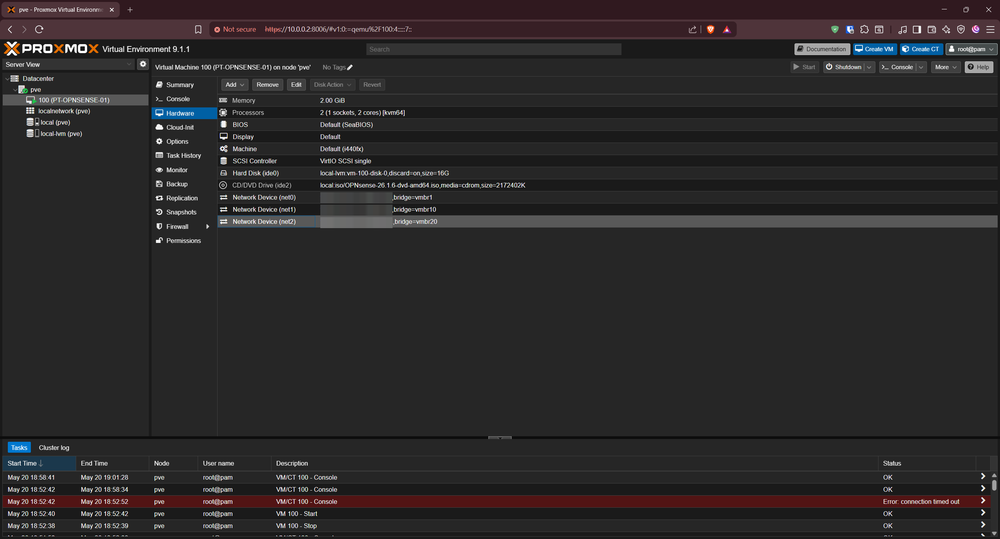
*PT-OPNSENSE-01 hardware configuration: 2GB RAM, 2 cores kvm64, 16GB disk, and three VirtIO NICs on vmbr1, vmbr10, and vmbr20*

### Step 3 - Install OPNsense

Started VM 100 and opened the console in Proxmox. Booted from the OPNsense ISO and logged in as `installer` with password `opnsense` when prompted. Proceeded through the installation:

- Selected **Install** from the menu
- Selected **UFS** as the filesystem

> ZFS was not used because 2GB RAM is insufficient for ZFS ARC overhead.

- Selected the 16GB virtual disk as the install target
- Set a strong root credential and kept it out of the repository
- Allowed the installer to reboot after completion

The installer confirmed successful completion before rebooting.

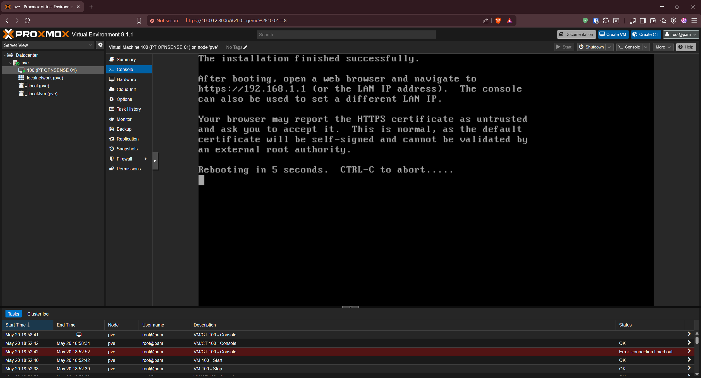
*OPNsense installer confirming successful installation before reboot*

After shutdown, the ISO was removed from the VM hardware before restarting.

### Step 4 - Assign interfaces via console

After reboot, the OPNsense console menu appeared. Selected option **1 - Assign Interfaces** and assigned interfaces in the following order:

| Interface | VirtIO NIC | Assignment |
|---|---|---|
| WAN | vtnet0 | Connected to vmbr1, WAN uplink |
| LAN | vtnet1 | Connected to vmbr10, Server VLAN |
| OPT1 | vtnet2 | Connected to vmbr20, Workstation VLAN |

### Step 5 - Configure interface IPs via console

Selected option **2 - Set Interface IP** for each interface and entered the following:

**WAN (vtnet0):** Configured via DHCP. Received IP `10.0.0.8` from the Xfinity Gateway.

**LAN (vtnet1):** Set static IP `172.16.10.1/24`. Enabled Dnsmasq DHCP temporarily with range `172.16.10.100` to `172.16.10.200`.

**OPT1 (vtnet2):** Set static IP `172.16.20.1/24`. Enabled Dnsmasq DHCP temporarily with range `172.16.20.100` to `172.16.20.200`.

> Both DHCP ranges are temporary. In Phase 3, DHCP will migrate to Windows Server on PT-DC-01, and OPNsense will act as a DHCP relay agent for VLAN 20.

The console confirmed all three interfaces with correct IPs after configuration.

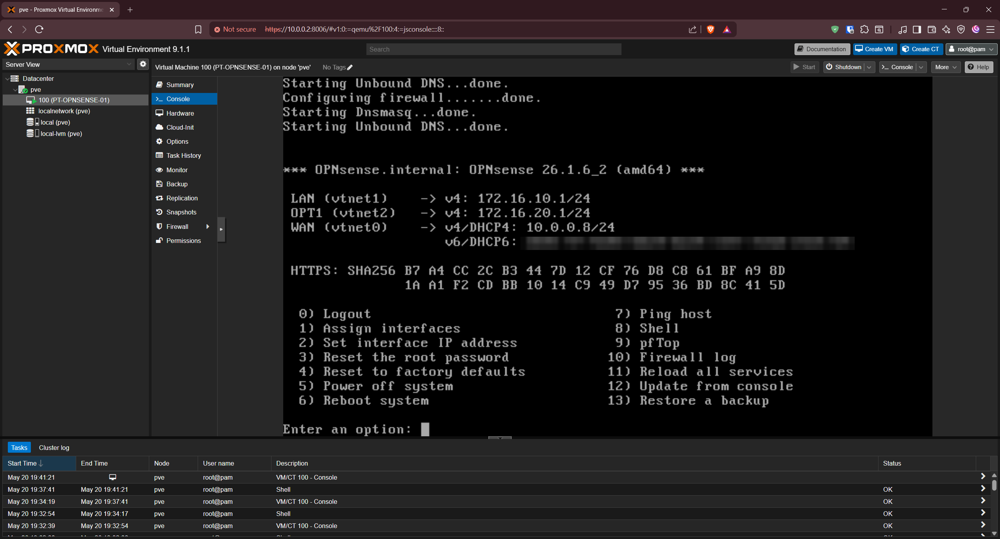
*OPNsense console: LAN 172.16.10.1/24, OPT1 172.16.20.1/24, and WAN 10.0.0.8/24 confirmed*

### Step 6 - Verify internet connectivity from OPNsense

Entered option **8 - Shell** from the OPNsense console menu to access the shell directly. Ran a ping test to bypass DNS and confirm raw internet connectivity through the WAN interface:

```bash
ping -c 4 1.1.1.1
```

All four packets returned with 0.0% packet loss, confirming OPNsense had a working WAN connection through the Xfinity Gateway.

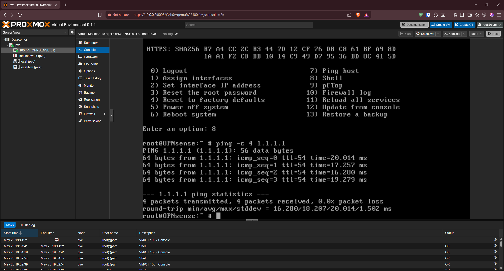
*OPNsense shell: `ping -c 4 1.1.1.1` confirming internet connectivity through WAN with 0.0% packet loss*

### Step 7 - Access the web UI from the host PC

OPNsense correctly blocks web UI access from the WAN side by default. Since the host PC is on the home LAN (10.0.0.x), it cannot reach `172.16.10.1` without a temporary workaround. Permanent access will come from the Windows VMs on VLAN 10 in Phase 3 and Phase 4.

For initial configuration, the following temporary workaround was used.

**From the OPNsense shell (option 8)**, disabled the packet filter to allow temporary WAN-side access:

```bash
pfctl -d
```

**From the Windows host PC**, opened PowerShell as Administrator and added a temporary static route to reach the LAN subnet through the OPNsense WAN IP:

```powershell
route add 172.16.10.0 mask 255.255.255.0 10.0.0.8
```

The static route gets the packet to OPNsense's WAN interface. `pfctl -d` prevents the default WAN-side firewall behavior from dropping it once it arrives.

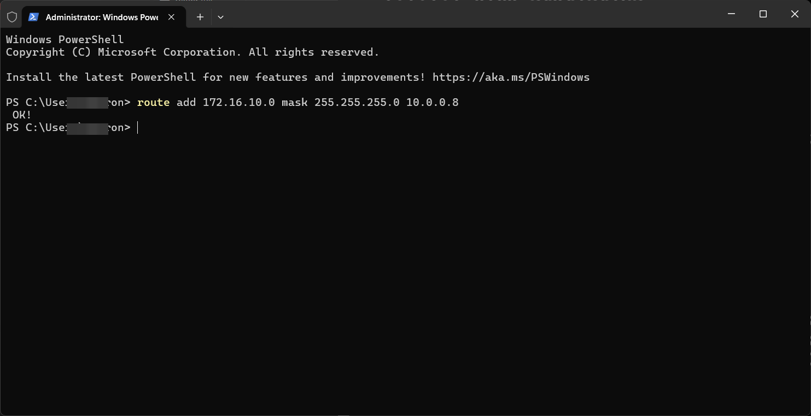
*Windows PowerShell: temporary static route added successfully to reach 172.16.10.0/24 through OPNsense WAN at 10.0.0.8*

Navigated to `https://172.16.10.1` and the OPNsense login page loaded successfully.

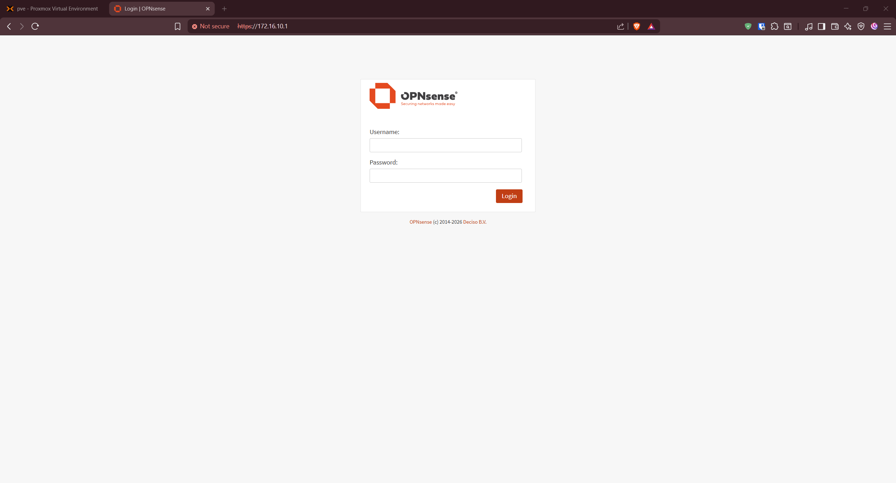
*OPNsense web UI login page at https://172.16.10.1, accessible after the temporary packet filter and static route workaround*

### Step 8 - Complete the setup wizard

On first login, OPNsense launched the setup wizard automatically. Stepped through each tab:

| Tab | Action |
|---|---|
| Welcome | Clicked Next |
| General Information | Set hostname: `PT-OPNSENSE-01`, domain: `corp.polktech.local` |
| Network [WAN] | Left as DHCP (default) |
| Network [LAN] | Confirmed 172.16.10.1 / 24 |
| Deployment type | Left default |
| Set initial password | Left root credential as configured during install |
| Finish | Clicked **Apply** |

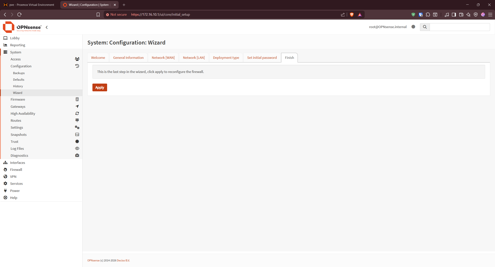
*Setup wizard Finish tab: clicking Apply commits the hostname and initial configuration*

After applying, OPNsense reloaded and confirmed the initial configuration was complete. The hostname in the top-right corner updated to `root@PT-OPNSENSE-01.corp.polktech.local`.

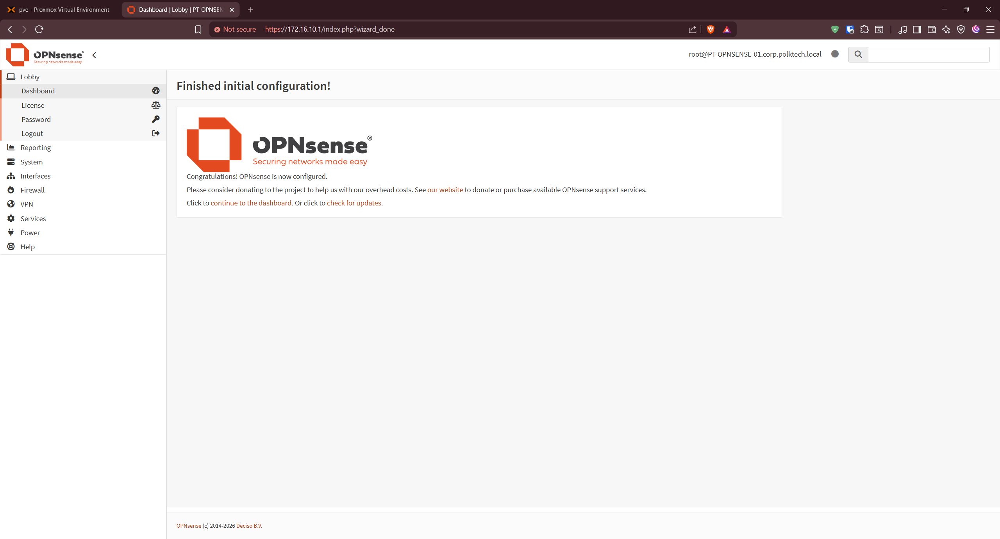
*Finished initial configuration confirmation: hostname set to PT-OPNSENSE-01.corp.polktech.local*

### Step 9 - Configure DNS

Navigated to **System > Settings > General** and scrolled to the **Networking** section. Set the DNS servers:

| Setting | Value |
|---|---|
| Primary DNS | 1.1.1.1 (Cloudflare) |
| Secondary DNS | 1.0.0.1 (Cloudflare) |

> DNS for lab VMs will be updated to 172.16.10.10 (PT-DC-01) in Phase 3 after the domain controller is built and DNS is configured.

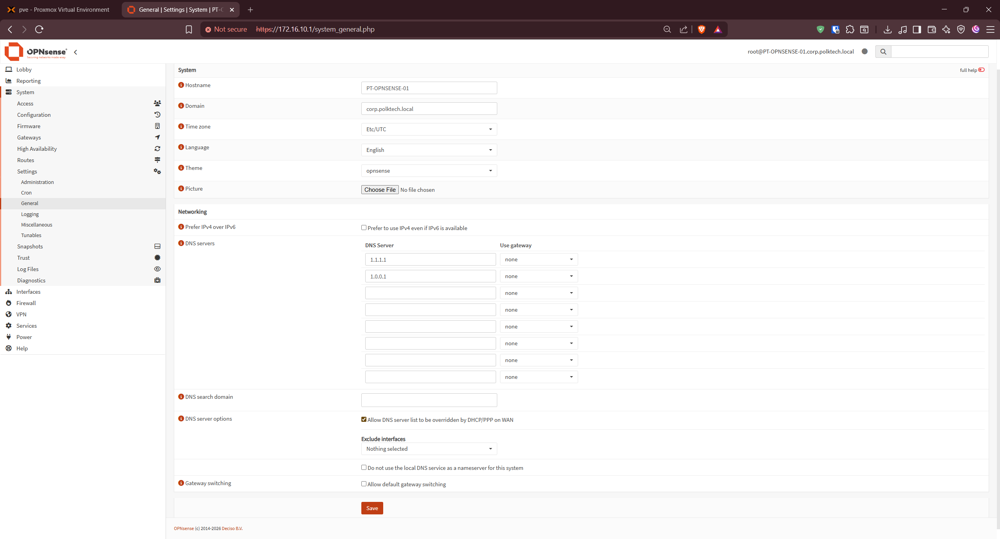
*System > Settings > General: DNS servers set to 1.1.1.1 and 1.0.0.1 (Cloudflare)*

### Step 10 - Verify interface assignments in the web UI

Navigated to **Interfaces > Assignments** to confirm the interface-to-device mapping matched the console configuration.

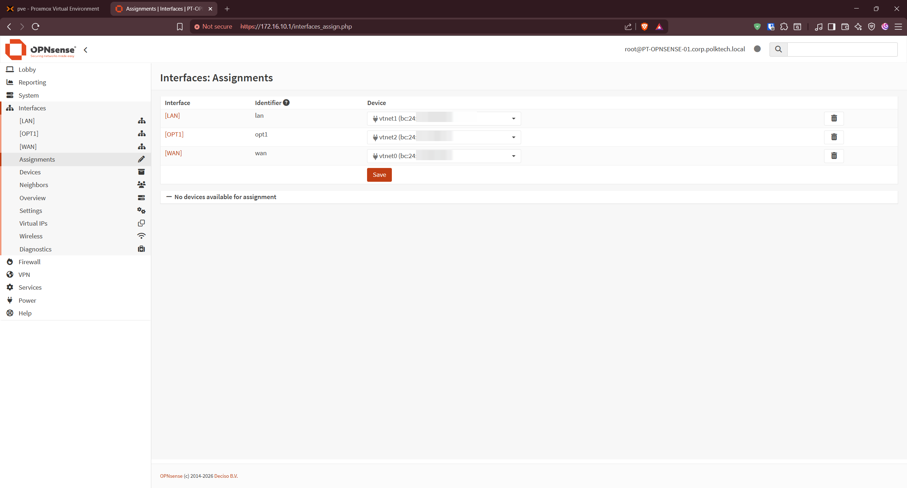
*Interfaces: Assignments showing LAN=vtnet1, OPT1=vtnet2, and WAN=vtnet0 confirmed*

### Step 11 - Configure OPT1 / VLAN 20 interface

Navigated to **Interfaces > [OPT1]** and configured the VLAN 20 interface:

| Setting | Value |
|---|---|
| Enable | Checked |
| Description | VLAN20 |
| Device | vtnet2 |
| IPv4 Configuration Type | Static IPv4 |
| IPv4 Address | 172.16.20.1 / 24 |
| IPv6 Configuration Type | None |

Clicked **Save** then **Apply changes**.

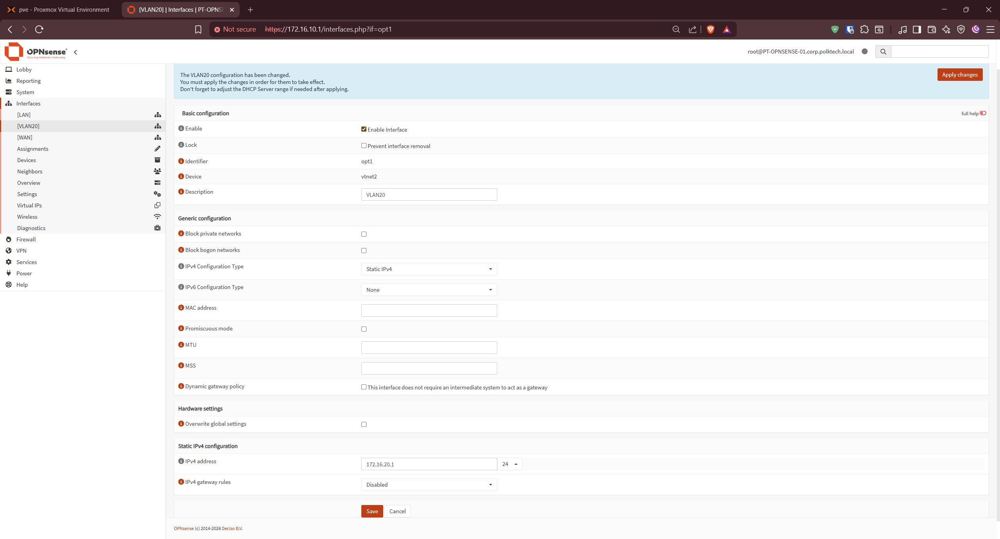
*[VLAN20] interface configuration: vtnet2, Static IPv4, 172.16.20.1/24*

### Step 12 - Verify DHCP ranges

Navigated to **Services > Dnsmasq DNS & DHCP > DHCP ranges** to confirm both ranges were correctly configured.

The initial LAN range was entered incorrectly as `172.16.10.41` to `172.16.10.245`. This was corrected to match the planned range before continuing.

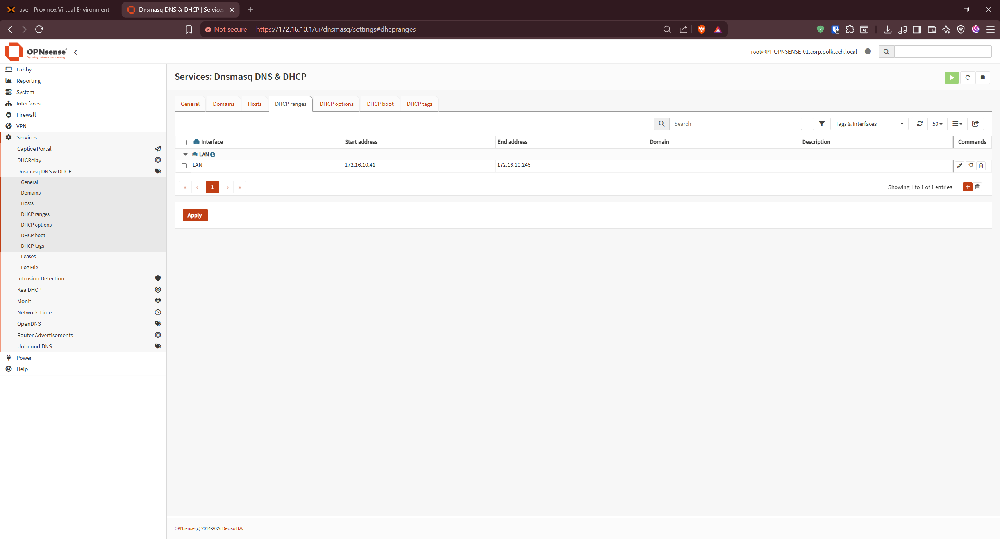
*Initial DHCP range entered incorrectly: LAN range was 172.16.10.41 to 172.16.10.245 before correction*

After correction, both ranges were confirmed:

| Interface | Start | End |
|---|---|---|
| LAN | 172.16.10.100 | 172.16.10.200 |
| VLAN20 | 172.16.20.100 | 172.16.20.200 |

> PT-DC-01 will be assigned 172.16.10.10 as a static IP outside the DHCP range.

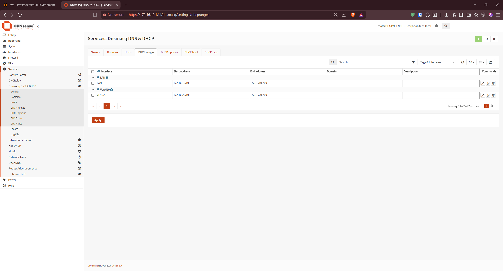
*Dnsmasq DHCP ranges: LAN 172.16.10.100 to 172.16.10.200 and VLAN20 172.16.20.100 to 172.16.20.200 confirmed*

### Step 13 - Configure firewall rules

Navigated to **Firewall > Rules** to review and configure rules for each interface.

**LAN (VLAN 10):** The default allow rules were already active and sufficient for Phase 2. No changes were needed.

| Rule | Action | Source | Destination | Protocol |
|---|---|---|---|---|
| Default LAN | Allow | LAN net | Any | IPv4 |
| Default LAN IPv6 | Allow | LAN net | Any | IPv6 |

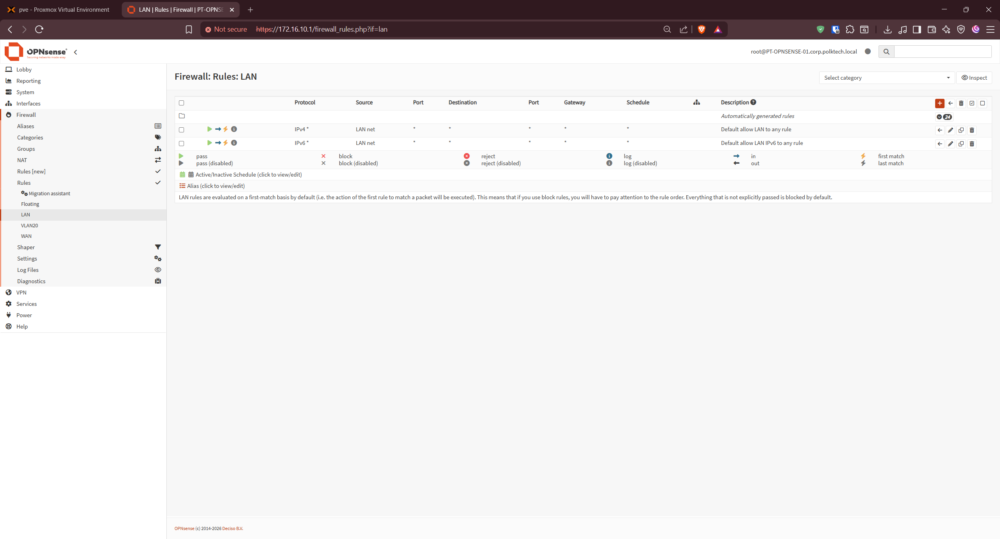
*Firewall: Rules: LAN, default allow rules active for IPv4 and IPv6*

**VLAN 20:** No default allow rules exist for OPT1 interfaces. All traffic was blocked until a rule was added manually.

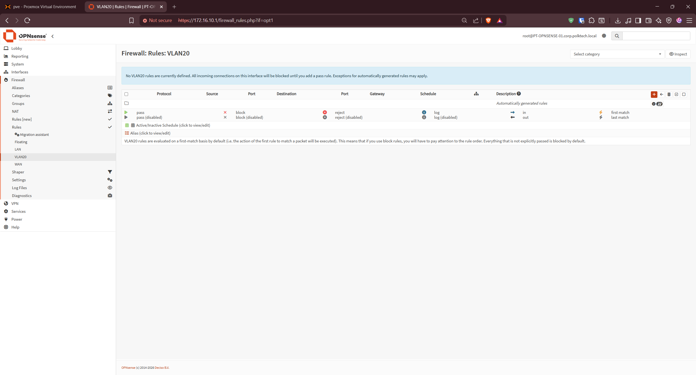
*Firewall: Rules: VLAN20, no rules defined and incoming connections blocked by default*

Navigated to **Firewall > Rules > VLAN20** and added an allow rule, then clicked **Apply changes**.

| Rule | Action | Source | Destination | Protocol |
|---|---|---|---|---|
| Allow VLAN20 to any | Allow | VLAN20 net | Any | IPv4 |

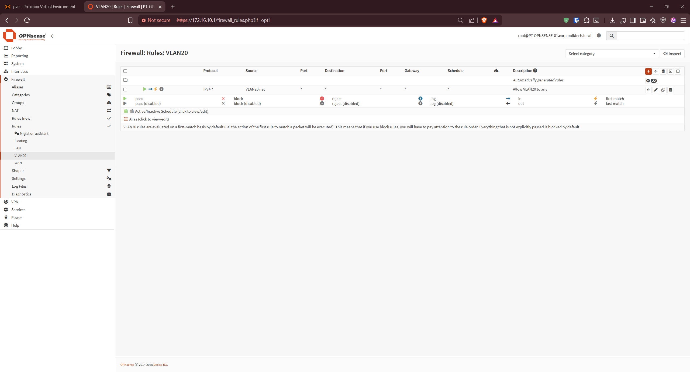
*Firewall: Rules: VLAN20, Allow VLAN20 to any rule added and applied*

**WAN:** Default block. No changes were needed. WAN-initiated traffic is blocked by default, which is correct behavior.

---

## VM Summary

The PT-OPNSENSE-01 VM summary in Proxmox confirms the VM is running correctly with expected resource usage after configuration was complete.

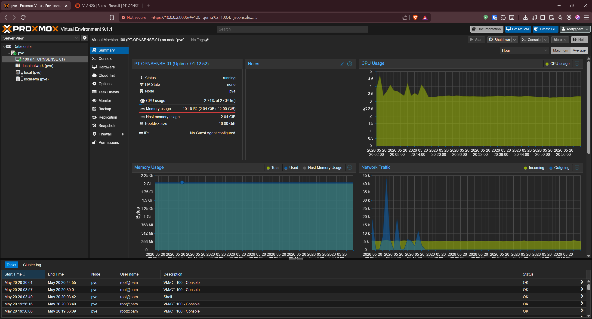
*PT-OPNSENSE-01 VM summary: running status, 2GB RAM, 16GB boot disk, and active CPU/network traffic visible*

---

## Validation

After configuration was complete, the OPNsense dashboard confirmed all three interfaces were active and Dnsmasq was running.

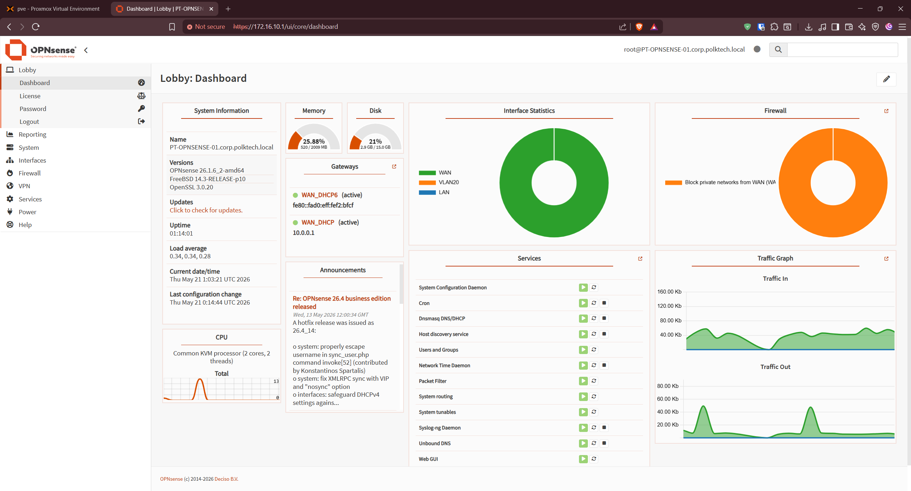
*OPNsense Lobby dashboard: WAN, LAN, and VLAN20 active; Dnsmasq running; traffic visible on all interfaces*

**All validation checks passed:**

- [x] PT-OPNSENSE-01 VM created with correct hardware
- [x] Three NICs assigned correctly: vtnet0/WAN, vtnet1/LAN, vtnet2/OPT1
- [x] OPNsense installed and booting
- [x] WAN receiving DHCP: 10.0.0.8 from Xfinity Gateway
- [x] LAN interface configured: 172.16.10.1/24
- [x] OPT1 interface configured: 172.16.20.1/24
- [x] DHCP active on LAN: 172.16.10.100 to 172.16.10.200
- [x] DHCP active on VLAN 20: 172.16.20.100 to 172.16.20.200
- [x] DNS configured: 1.1.1.1 / 1.0.0.1
- [x] Firewall rules applied: LAN and VLAN 20 allow, WAN block
- [x] OPNsense internet connectivity confirmed with 0.0% packet loss
- [x] Home LAN not disrupted; host PC retained internet access throughout

Also verified Proxmox host connectivity to the Xfinity Gateway was unaffected throughout the entire phase:

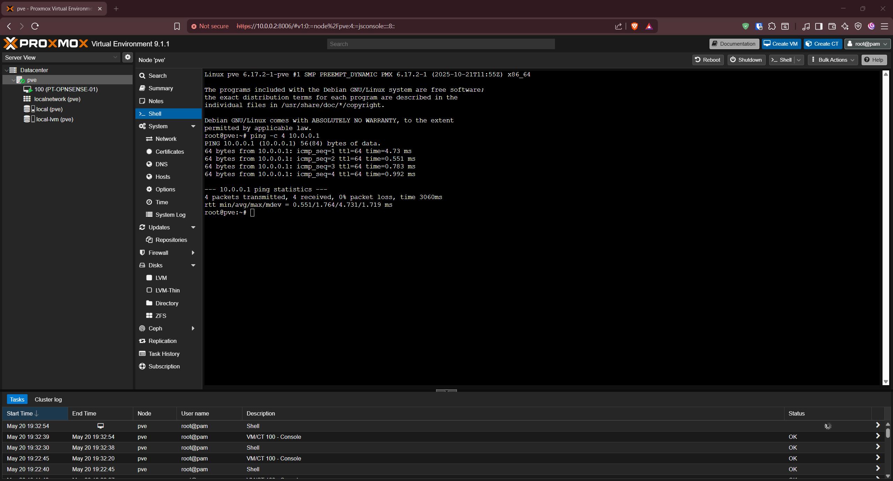
*Proxmox shell: `ping -c 4 10.0.0.1` confirming home LAN connectivity was not disrupted*

---

## Troubleshooting Notes

**Problem:** WAN not receiving DHCP after cable plugged into ACT/LNK A

**Cause:** The Intel 82576 PCIe card's physical bracket labels are reversed relative to Proxmox's NIC assignment. nic1 maps to ACT/LNK **B**, not ACT/LNK A as assumed. Running `ethtool nic1 | grep "Link detected"` from the Proxmox shell confirmed `Link detected: no` while the cable was in ACT/LNK A.

**Resolution:** Moved the WAN Ethernet cable from ACT/LNK A to ACT/LNK B. WAN came up immediately and received 10.0.0.8 from the Xfinity Gateway.

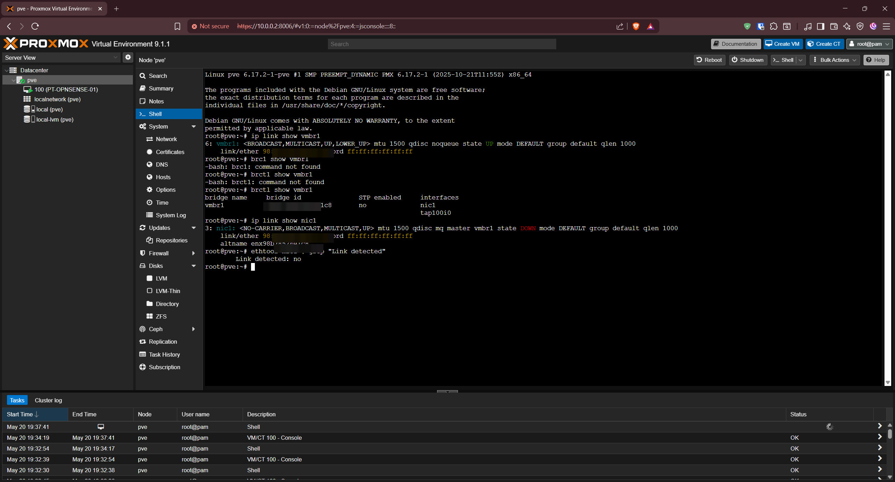
*Proxmox shell: ethtool confirming `Link detected: no` on nic1 while the WAN cable was in the wrong port*


---

**Problem:** OPNsense web UI not accessible from host PC

**Cause:** OPNsense correctly blocks WAN-side access to the web UI by default. The host PC is on the 10.0.0.x home LAN, which OPNsense treats as the WAN side. Without a route to 172.16.10.0/24, the browser had no path to the LAN interface.

**Resolution:** Used `pfctl -d` from the OPNsense shell to temporarily disable the packet filter, and added a temporary static route on the host PC using PowerShell to route 172.16.10.0/24 through 10.0.0.8. Both were required: the route provided the path, and `pfctl -d` prevented the WAN-side firewall rules from blocking the connection.

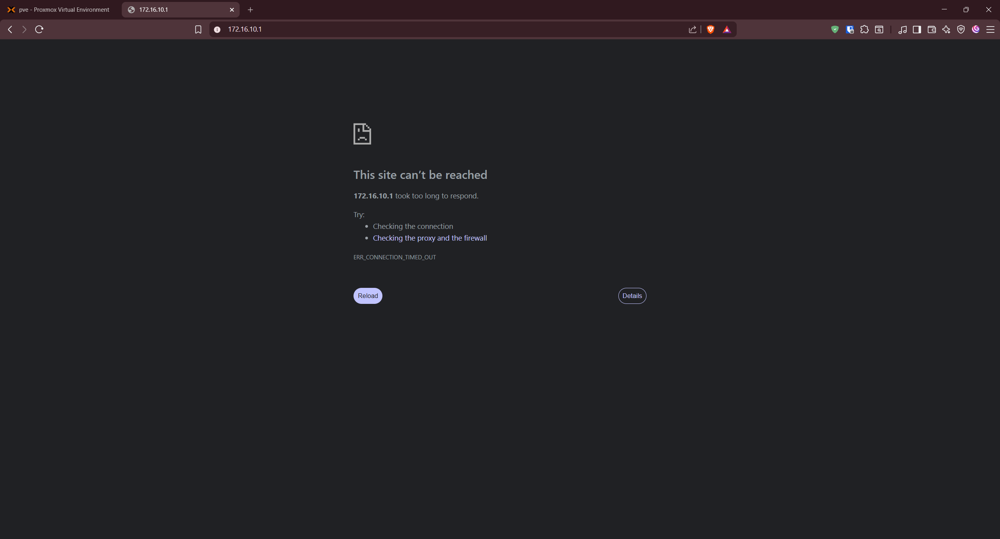
*ERR_CONNECTION_TIMED_OUT at 172.16.10.1 before the temporary packet filter and static route workaround were applied*

---

**Problem:** OPNsense "Ping host" option (option 7) failed with DNS error

**Cause:** DNS was not yet configured when the connectivity test was attempted.

**Resolution:** Used option 8 (Shell) and ran `ping -c 4 1.1.1.1` directly to bypass DNS and test raw IP connectivity. Confirmed 0.0% packet loss.

---

**Problem:** DHCPDISCOVER looping on vtnet0 with no response

**Cause:** The WAN cable was plugged into the wrong physical port (ACT/LNK A instead of ACT/LNK B), so vtnet0 had no physical link to the Xfinity Gateway. DHCP discovery continued broadcasting with no server to respond.

**Resolution:** Same as the NIC port mapping issue above. Moved the cable to ACT/LNK B.

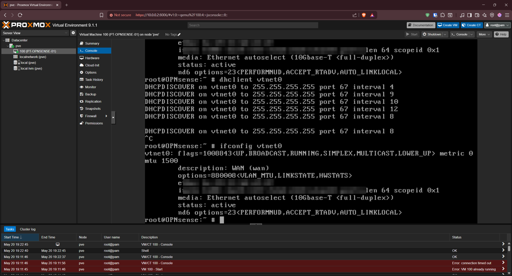
*OPNsense shell: DHCPDISCOVER looping on vtnet0 with no response, confirming no physical link on WAN*

---

**Problem:** Initial DHCP range entered incorrectly

**Cause:** LAN DHCP range was entered as 172.16.10.41 to 172.16.10.245 instead of the planned 172.16.10.100 to 172.16.10.200.

**Resolution:** Edited the range in **Services > Dnsmasq DNS & DHCP > DHCP ranges** and clicked Apply to correct both the start and end addresses.

---

## What I Learned

- OPNsense interface assignment order matters; verifying vtnet-to-bridge mapping before proceeding prevents rework
- Physical NIC port labels on PCIe cards are not guaranteed to match the order the hypervisor enumerates them, so verification with `ethtool` or `ip link` is important
- OPNsense correctly blocks all WAN-side access to the web UI by default; this is expected behavior, not a misconfiguration
- OPT1 interfaces in OPNsense have no default allow rules unlike LAN; each additional interface requires a manual firewall rule to pass traffic
- Internal-only bridges in Proxmox (vmbr10, vmbr20) with no physical NIC attached are an effective way to create isolated lab segments that never touch the home network
- DHCP on OPNsense via Dnsmasq is straightforward to configure temporarily and easy to migrate away from in a later phase

---

## Real-World IT Relevance

Virtual firewall deployment is a foundational skill in modern enterprise IT environments. Running OPNsense as a VM on Proxmox mirrors how organizations deploy virtual network appliances in VMware vSphere or Hyper-V environments, where a dedicated VM handles routing, firewall enforcement, and DHCP for segmented networks.

Understanding VLAN segmentation, firewall rule logic, and the difference between WAN-side and LAN-side access applies directly to network administrator, systems administrator, and security analyst roles. The troubleshooting process in this phase used realistic diagnostics: `ethtool` to diagnose a no-link condition, DHCPDISCOVER behavior to identify a physical connectivity problem, and `pfctl -d` to temporarily isolate a firewall access issue.

---

## Future Improvements

- Configure a DHCP static reservation for OPNsense WAN (10.0.0.8) on the Xfinity Gateway to prevent the IP from changing
- Migrate DHCP from Dnsmasq to Windows Server DHCP on PT-DC-01 in Phase 3, with OPNsense acting as DHCP relay for VLAN 20
- Update DNS from Cloudflare (1.1.1.1) to PT-DC-01 (172.16.10.10) after Active Directory DNS is configured
- Explore Suricata IDS rules and WireGuard VPN as future additions after the core lab is complete

---

## Next Phase

[Phase 3 - Windows Server and Active Directory](../phase-3-windows-server/)
