# Phase 3 - Windows Server and Active Directory
## PolkTech SOHO Active Directory Homelab

---

## Objective

Deploy a Windows Server 2025 virtual machine on the Proxmox hypervisor, configure a static IP on the Server VLAN, install the Active Directory Domain Services role, and promote the server to the root domain controller for a new forest. PT-DC-01 becomes the identity, DNS, and authentication foundation that every later phase depends on.

---

## Environment

| Component | Details |
|---|---|
| Host | Dell OptiPlex 3080 SFF |
| Hypervisor | Proxmox VE 9.1.1 |
| VM Name | PT-DC-01 (VM ID 101) |
| OS | Windows Server 2025 Standard Evaluation (Desktop Experience) |
| VM Resources | 2 cores (host), 4GB RAM, 60GB disk |
| Machine Type | Q35 (pc-q35-10.1), SeaBIOS, TPM 2.0 |
| Static IP | 172.16.10.10/24 |
| Gateway | 172.16.10.1 (OPNsense LAN interface) |
| Domain | corp.polktech.local |
| NetBIOS Name | POLKTECH |

> Naming note: the domain controller hostname is `PT-DC-01`. The Active Directory domain is `corp.polktech.local` with the NetBIOS name `POLKTECH`. NetBIOS names are written in all caps by convention.

---

## Tools and Technologies

- Windows Server 2025 Standard Evaluation (Desktop Experience)
- Active Directory Domain Services (AD DS)
- DNS Server role (installed with AD DS)
- VirtIO storage and network drivers (virtio-win ISO)
- QEMU Guest Agent (installed with the VirtIO driver package)
- Server Manager, Active Directory Users and Computers, DNS Manager
- `ipconfig` and `nslookup` for validation

---

## Network Design

PT-DC-01 connects to the internal Server VLAN bridge (vmbr10) established in Phase 1. All traffic routes through OPNsense, which acts as the gateway and the path to the internet.

| Setting | Value |
|---|---|
| Bridge | vmbr10 (VLAN 10, Server VLAN) |
| IP Address | 172.16.10.10/24 static |
| Default Gateway | 172.16.10.1 (OPNsense) |
| Primary DNS | 127.0.0.1 |
| Alternate DNS | 172.16.10.10 |

The domain controller points DNS at itself (127.0.0.1) so it resolves its own domain locally, which is standard practice for a DC running the DNS role.

---

## Installation Steps

### Step 1 - Create the Windows Server VM

Logged into the Proxmox web UI at `https://10.0.0.2:8006` and clicked **Create VM**. Configured the VM with the following settings:

**General**

| Setting | Value |
|---|---|
| VM ID | 101 |
| Name | PT-DC-01 |

**OS**

| Setting | Value |
|---|---|
| ISO | Windows Server 2025 evaluation ISO |
| Guest OS Type | Microsoft Windows |
| Version | 11/2022 |

> There is no Server 2025 option in the Proxmox version dropdown. 11/2022 is the correct selection because Server 2025 shares the same kernel generation.

**System**

| Setting | Value |
|---|---|
| Machine | Q35 (pc-q35-10.1) |
| BIOS | SeaBIOS (default) |
| SCSI Controller | VirtIO SCSI single |
| TPM | v2.0 (added automatically with Q35) |
| QEMU Agent | Enabled |

**Disks**

| Setting | Value |
|---|---|
| Bus | SCSI |
| Storage | local-lvm |
| Disk Size | 60GB |
| Cache | Write back |

**CPU**

| Setting | Value |
|---|---|
| Cores | 2 |
| Type | host |

> The `host` CPU type is used for Windows VMs to expose the full CPU feature set. This differs from the OPNsense VM in Phase 2, which used kvm64.

**Memory**

| Setting | Value |
|---|---|
| RAM | 4096 MB (4GB) |

**Network**

| Setting | Value |
|---|---|
| Bridge | vmbr10 |
| Model | VirtIO (paravirtualized) |

Before starting the VM, a second CD/DVD drive was added and pointed at the virtio-win ISO so the VirtIO drivers would be available during installation.

| Drive | ISO |
|---|---|
| ide0 | virtio-win.iso (VirtIO drivers) |
| ide2 | Windows Server 2025 evaluation ISO |

The Hardware tab was reviewed to confirm both ISOs, the 60GB disk, and the VirtIO network adapter on vmbr10 were present before first boot.

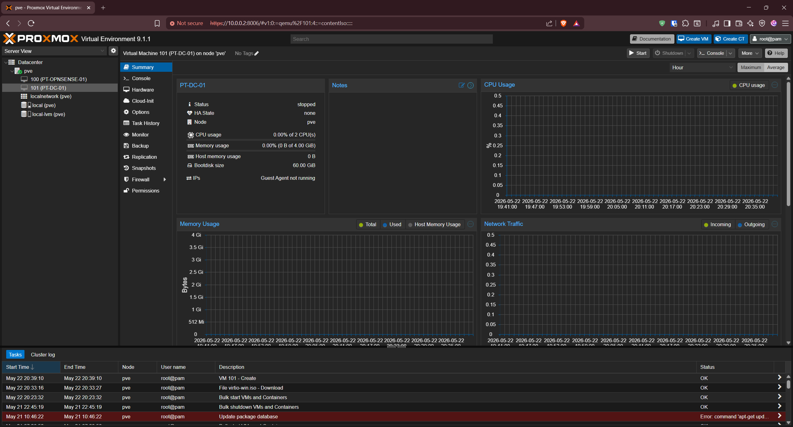
*PT-DC-01 VM summary: 4GB RAM, 2 cores, 60GB boot disk on vmbr10*

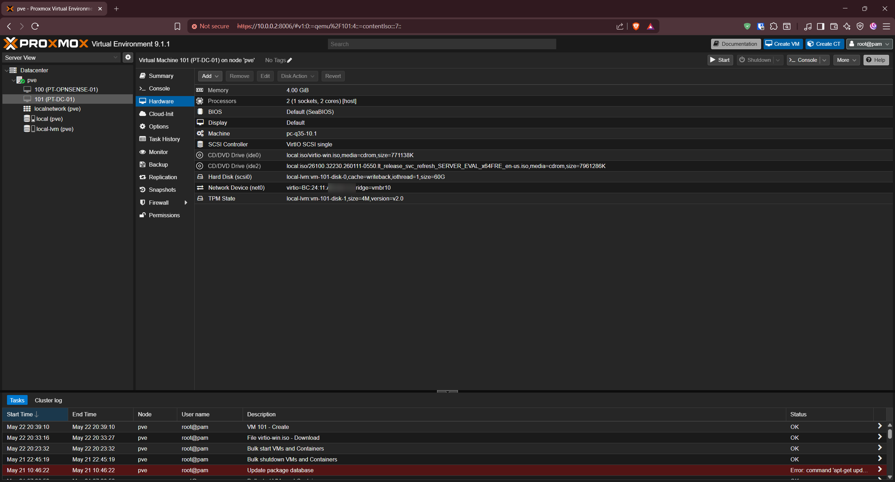
*Hardware tab: both ISOs attached, VirtIO SCSI disk, and VirtIO network adapter on vmbr10*

### Step 2 - Install Windows Server 2025

Started the VM and opened the console in Proxmox. Booted from the Windows Server 2025 ISO and left the language and region at English (United States).

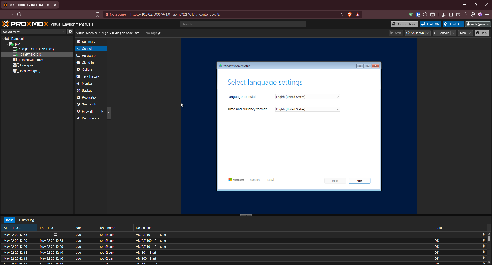
*Windows Server Setup: language and region selection*

Selected the **Desktop Experience** edition to install the full GUI environment. The Core edition was intentionally avoided because this lab demonstrates Server Manager, the AD DS graphical tools, and Group Policy management.

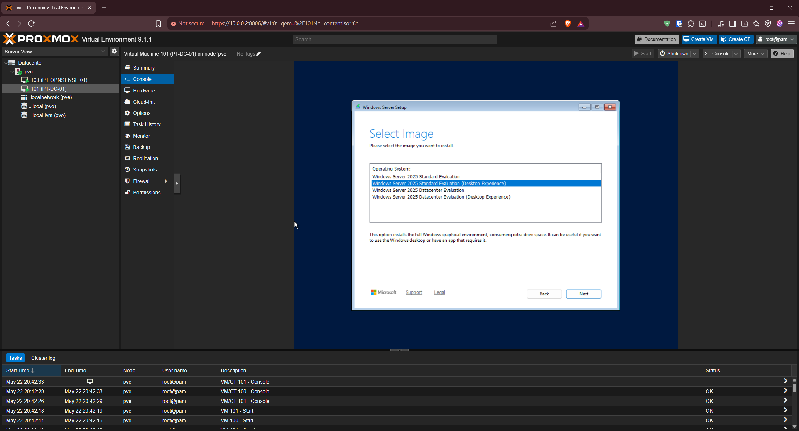
*Windows Server 2025 Standard Evaluation (Desktop Experience) selected*

On the disk selection screen the 60GB virtual disk was not visible. This is expected behavior because Windows does not include VirtIO drivers, and the VM disk uses the VirtIO SCSI controller.

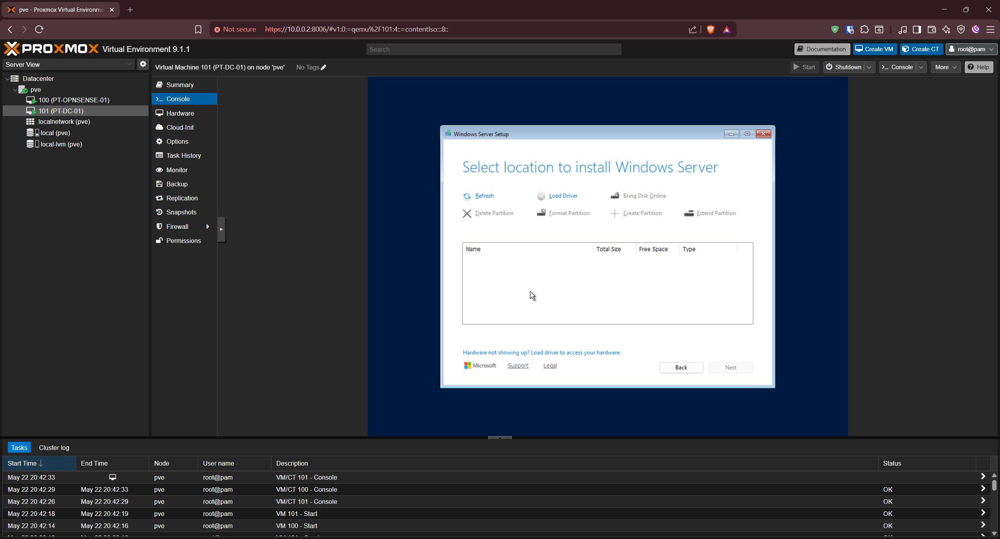
*Empty disk list: the VirtIO storage driver has not been loaded yet*

Used the **Load Driver** option and browsed to the virtio-win ISO at `vioscsi > 2k25 > amd64`. After loading the driver the 60GB disk appeared immediately.

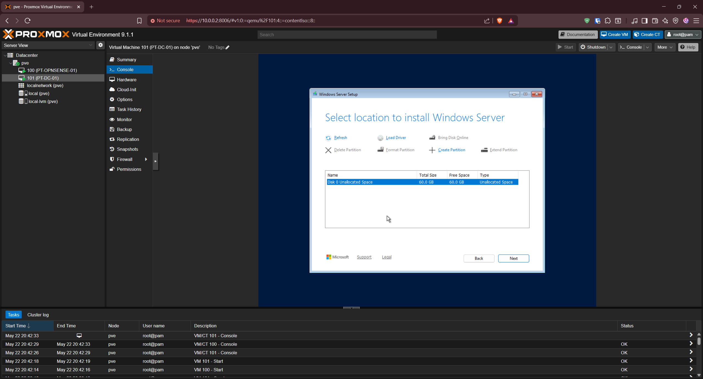
*Disk 0 Unallocated Space (60GB) visible after the VirtIO storage driver was loaded*

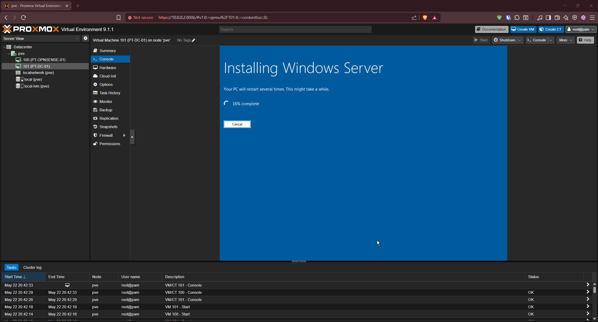
*Installing Windows Server: progress at 16 percent*

### Step 3 - Set Administrator password and initial login

After installation completed, the built-in Administrator password was set on the first-boot Customize Settings screen.

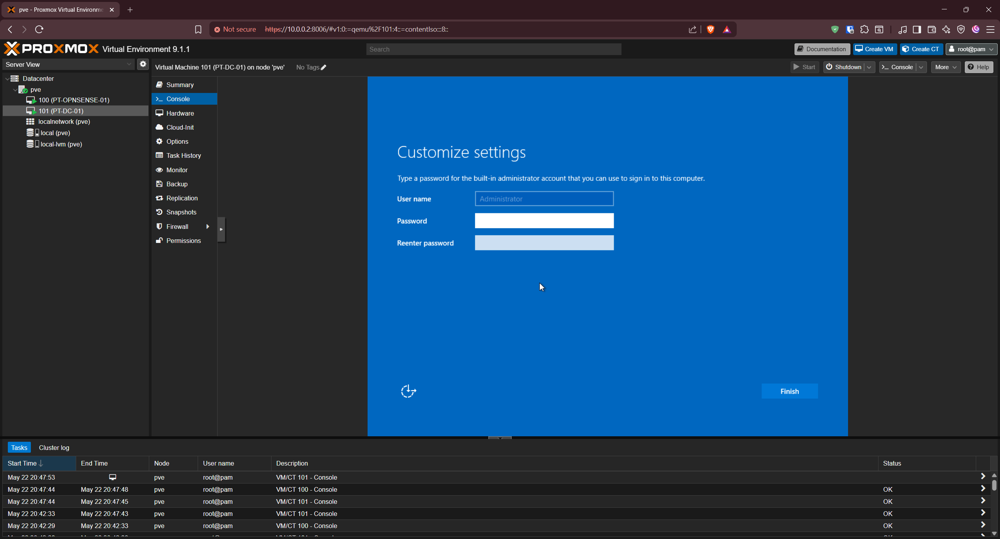
*Customize settings: built-in Administrator password configuration*

Server Manager opened automatically after the first login.

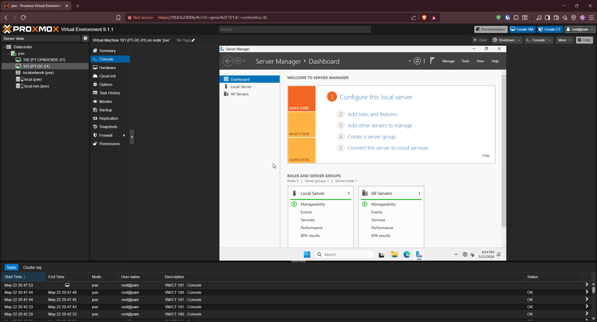
*Server Manager dashboard on a fresh installation with no roles installed*

### Step 4 - Install VirtIO network driver

The network adapter was not visible in Network Connections after installation. This is the same VirtIO driver situation as the storage controller, applied to the network adapter.

Ran `virtio-win-gt-x64.msi` from the virtio-win CD drive inside the VM. This installs the full VirtIO driver set, including the network driver and the QEMU Guest Agent. The guest agent allows Proxmox to report the VM's IP address on the summary tab and enables clean shutdown behavior.

After installation, the Red Hat VirtIO Ethernet Adapter appeared in Network Connections.

### Step 5 - Configure static IP

Opened the IPv4 properties of the network adapter and configured a static IP on the Server VLAN.

| Setting | Value |
|---|---|
| IP Address | 172.16.10.10 |
| Subnet Mask | 255.255.255.0 |
| Default Gateway | 172.16.10.1 |
| Preferred DNS | 127.0.0.1 |
| Alternate DNS | 172.16.10.10 |

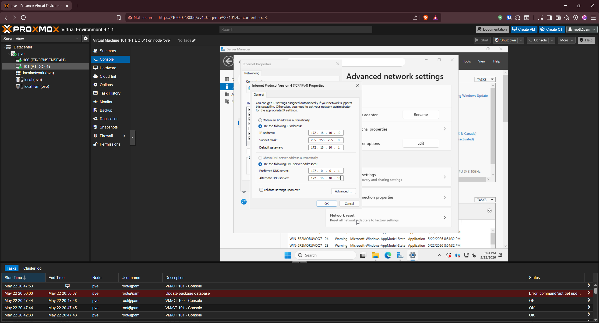
*IPv4 properties: static IP 172.16.10.10/24, gateway 172.16.10.1, DNS 127.0.0.1*

### Step 6 - Rename the server

The default Windows hostname was renamed to `PT-DC-01` before promoting to a domain controller. Renaming after promotion is not recommended because it can cause problems with Active Directory and Kerberos.

Navigated to **Server Manager > Local Server**, clicked the computer name, and changed it to `PT-DC-01`, then restarted.

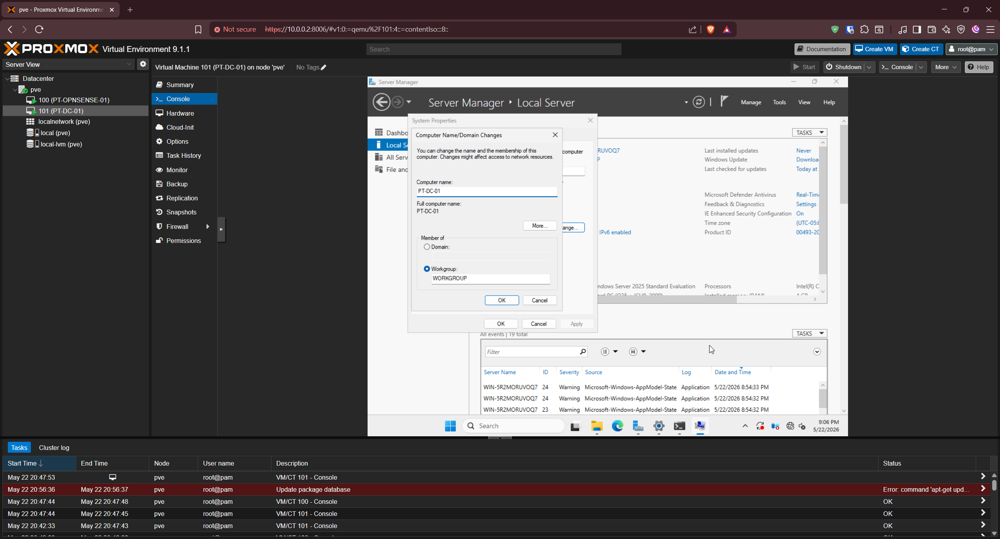
*Computer Name/Domain Changes: hostname set to PT-DC-01 before promotion*

After the restart, connectivity was confirmed before continuing.

```text
ping 172.16.10.1   (OPNsense gateway)   0% packet loss
ping 1.1.1.1       (internet via OPNsense) 0% packet loss
```

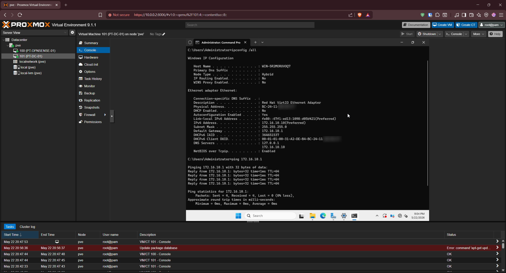
*ipconfig /all and ping confirming correct IP, gateway, DNS, and 0% packet loss to gateway and internet*

### Step 7 - Install the AD DS role

From Server Manager, used **Manage > Add Roles and Features**. On the Server Roles page, selected **Active Directory Domain Services** and accepted the additional features it required.

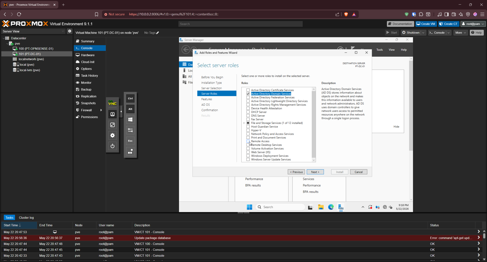
*Server Roles page: Active Directory Domain Services selected, destination server PT-DC-01*

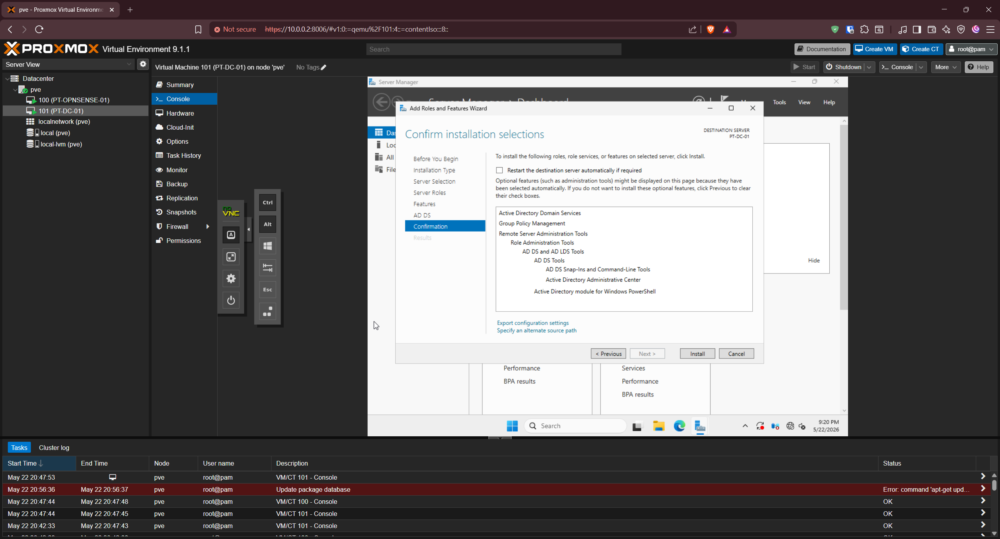
*Confirmation page listing AD DS, Group Policy Management, and Remote Server Administration Tools*

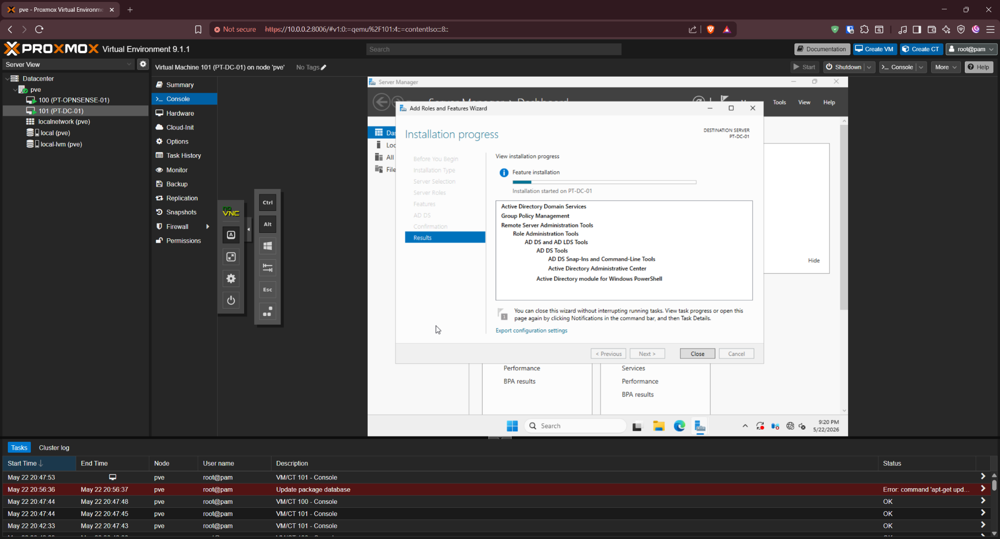
*AD DS role installation in progress on PT-DC-01*

### Step 8 - Promote to domain controller

After the role installed, the server was restarted before running the promotion wizard. Running the wizard immediately after the role install without restarting produces the error *Role change is in progress or this computer needs to be restarted*.

After restart, used the yellow flag notification in Server Manager to launch the **Active Directory Domain Services Configuration Wizard**. On the Deployment Configuration page, selected **Add a new forest** and entered the root domain name.

| Setting | Value |
|---|---|
| Deployment operation | Add a new forest |
| Root domain name | corp.polktech.local |
| NetBIOS name | POLKTECH |
| DNS server | Yes |
| Global Catalog | Yes |
| DSRM password | Set during the wizard (not committed to the repo) |

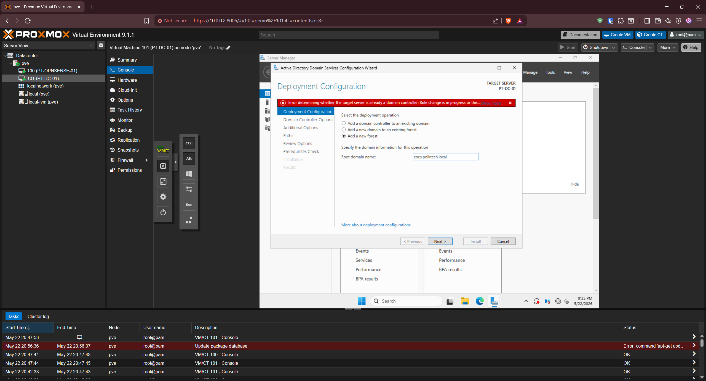
*Deployment Configuration: Add a new forest, root domain name corp.polktech.local*

The prerequisites check passed. The DNS delegation warning is expected and normal for a new forest because there is no parent DNS zone to delegate from.

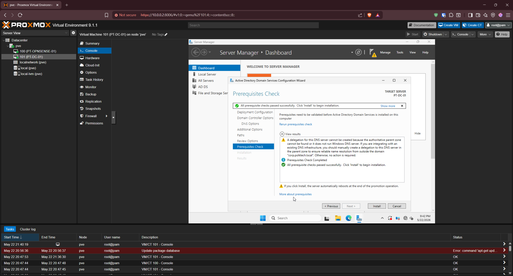
*Prerequisites Check: all checks passed; the DNS delegation warning is expected for a new forest*

Clicked **Install**. The server promoted and rebooted automatically.

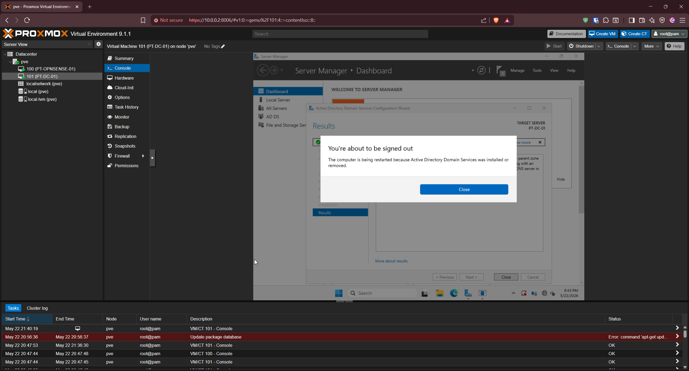
*"You're about to be signed out": AD DS promotion complete, server rebooting automatically*

---

## Validation

After the server rebooted, all core services were verified.

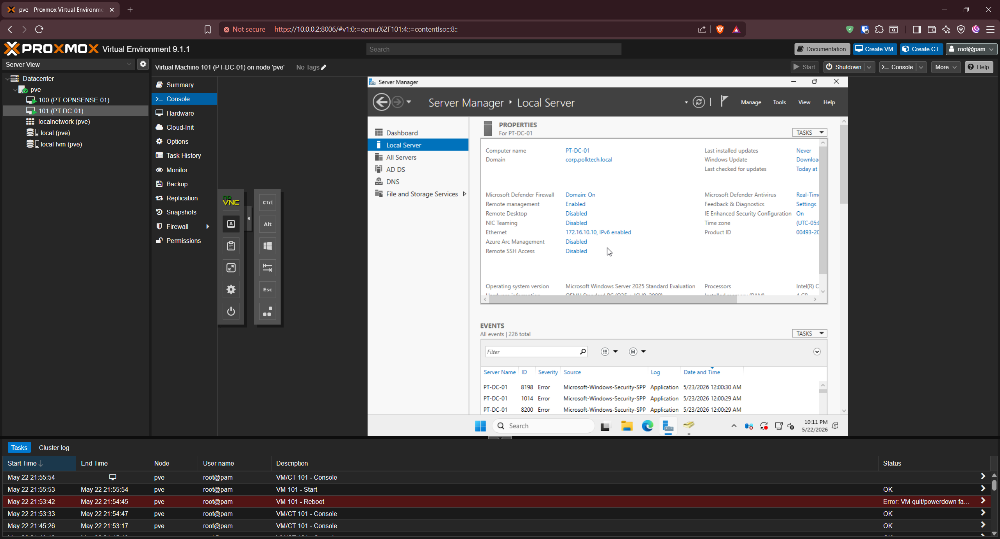
*Local Server: Computer name PT-DC-01, Domain corp.polktech.local, Ethernet 172.16.10.10*

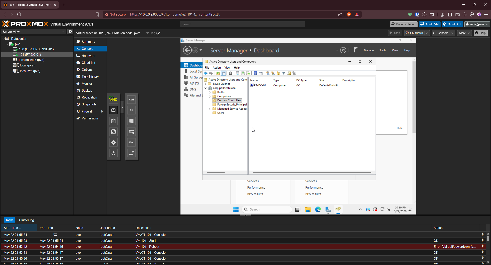
*Active Directory Users and Computers: corp.polktech.local tree, PT-DC-01 listed in Domain Controllers as a Global Catalog server*

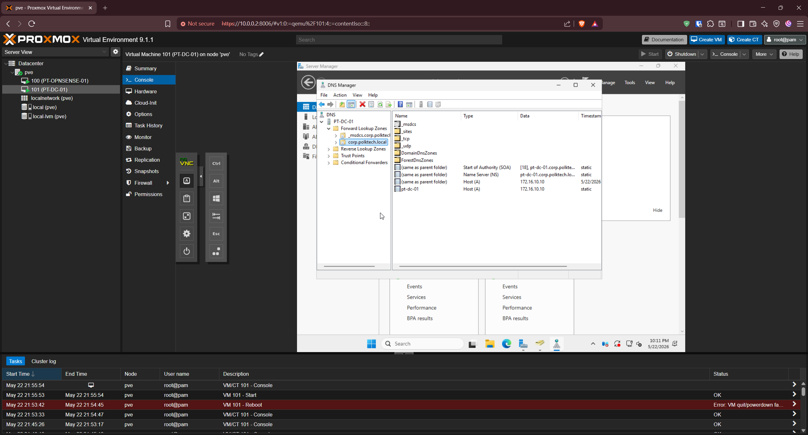
*DNS Manager: corp.polktech.local forward lookup zone with SOA, NS, and Host A records confirmed*

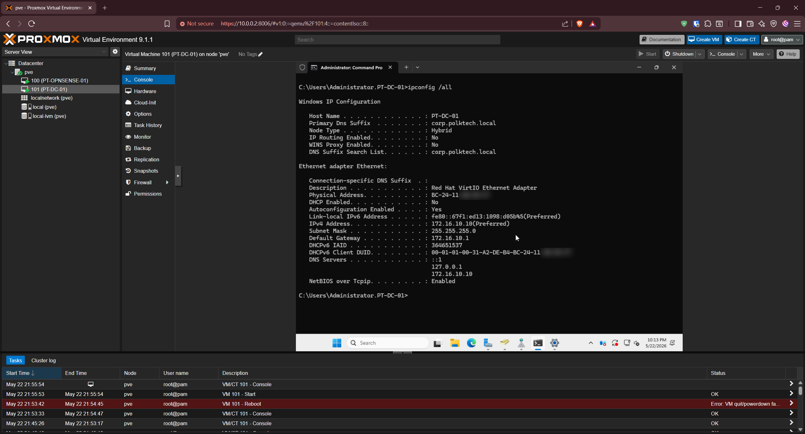
*ipconfig /all: Primary DNS Suffix corp.polktech.local confirmed, IP and DNS settings intact*

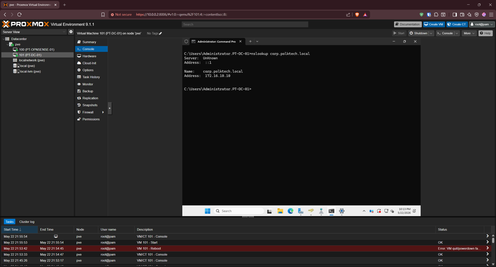
*nslookup corp.polktech.local resolves to 172.16.10.10, confirming domain DNS is functioning*

**All validation checks passed:**

- [x] PT-DC-01 reachable at 172.16.10.10
- [x] Ping to OPNsense gateway (172.16.10.1) with 0% packet loss
- [x] Ping to internet (1.1.1.1) successful through OPNsense
- [x] Primary DNS Suffix shows corp.polktech.local in ipconfig /all
- [x] PT-DC-01 listed in the Domain Controllers OU as a Global Catalog server
- [x] corp.polktech.local forward lookup zone present in DNS Manager
- [x] nslookup corp.polktech.local resolves to 172.16.10.10

---

## Troubleshooting Notes

**Problem:** Virtual disk not visible during Windows installation

**Cause:** Windows does not include VirtIO drivers. The VM disk uses the VirtIO SCSI controller, which is invisible to the Windows installer until the driver is loaded.

**Resolution:** Used the Load Driver option during installation and loaded the VirtIO SCSI driver from the virtio-win ISO at `vioscsi > 2k25 > amd64`. The 60GB disk appeared immediately after the driver loaded.

---

**Problem:** Network adapter not visible after installation

**Cause:** Same VirtIO driver situation as the storage controller. The network adapter uses the VirtIO NIC, which requires the NetKVM driver before Windows can detect it.

**Resolution:** Ran `virtio-win-gt-x64.msi` from the virtio-win CD drive to install the full VirtIO driver set, including the network driver and the QEMU Guest Agent. The adapter appeared in Network Connections after installation.

---

**Problem:** AD DS promotion failed at the prerequisites check

**Cause:** The promotion wizard was launched immediately after the AD DS role installation without restarting the server first. The prerequisites check reported *Role change is in progress or this computer needs to be restarted*.

**Resolution:** Closed the wizard, restarted PT-DC-01, and re-ran the promotion wizard after the server came back up. The prerequisites check passed on the second run.

---

## What I Learned

- VirtIO drivers must be loaded for both storage and network on Windows VMs in Proxmox; the storage driver is loaded during installation, and the full driver package installs the network driver and guest agent afterward
- The QEMU Guest Agent is what allows Proxmox to report a Windows VM's IP address and perform a clean shutdown
- A domain controller should point its DNS at itself (127.0.0.1) so it resolves its own domain locally
- A server must be renamed before promotion, never after, to avoid Active Directory and Kerberos issues
- The AD DS role installation and the domain controller promotion are two separate steps, and the server must be restarted between them
- The DNS delegation warning during promotion is expected for a new forest and does not indicate a problem

---

## Real-World IT Relevance

Domain controllers are the foundation of nearly every enterprise Windows environment. Authentication, Group Policy, and resource access all depend on Active Directory and its integrated DNS. Building a domain controller, including understanding why VirtIO drivers are required, why the hostname must be set before promotion, and why DNS is critical to AD DS, maps directly to the work expected of a junior systems administrator, a help desk technician supporting a domain, or an IT support analyst in a Windows environment.

The troubleshooting in this phase reflects real deployment scenarios: missing paravirtualized drivers on a new VM, and a failed prerequisites check caused by skipping a required restart. Both are common situations and both are covered in CompTIA and Microsoft certification material.

---

## Future Improvements

- Create an Organizational Unit structure and test user accounts in Phase 4
- Configure Group Policy Objects for the domain in a later phase
- Migrate DHCP from OPNsense Dnsmasq to Windows Server DHCP on PT-DC-01, with OPNsense acting as a DHCP relay for VLAN 20
- Update OPNsense DNS from Cloudflare (1.1.1.1) to PT-DC-01 (172.16.10.10) so lab clients resolve domain names through Active Directory DNS

---

## Next Phase

[Phase 4 - Windows 11 Client and Domain Join](../phase-4-windows-11/)
