# Phase 4 - Windows 11 Client and Domain Join
## PolkTech SOHO Active Directory Homelab

---

## Objective

Deploy a Windows 11 client virtual machine on the Proxmox hypervisor, place it on the Workstation VLAN, join it to the `corp.polktech.local` domain, and verify that both a domain administrator and a standard domain user can log in. PT-PC-01 is the first workstation in the lab and proves that the Active Directory environment built in Phase 3 is functioning end to end.

---

## Environment

| Component | Details |
|---|---|
| Host | Dell OptiPlex 3080 SFF |
| Hypervisor | Proxmox VE 9.1.1 |
| VM Name | PT-PC-01 (VM ID 102) |
| OS | Windows 11 Enterprise Evaluation |
| VM Resources | 2 cores (host), 4GB RAM, 60GB disk |
| Machine Type | Q35 (pc-q35-10.1), OVMF (UEFI), TPM 2.0 |
| IP Address | 172.16.20.188/24 (DHCP from OPNsense) |
| Gateway | 172.16.20.1 (OPNsense VLAN 20 interface) |
| Domain | corp.polktech.local |
| NetBIOS Name | POLKTECH |

> Naming note: the workstation hostname is `PT-PC-01`. The PC suffix describes the role (workstation) rather than the operating system, so the name does not need to change if the OS is upgraded later.

---

## Tools and Technologies

- Windows 11 Enterprise Evaluation
- VirtIO storage and network drivers (virtio-win ISO)
- QEMU Guest Agent (installed with the VirtIO driver package)
- Active Directory Users and Computers (run on PT-DC-01)
- `ipconfig` and `nslookup` for validation

---

## Network Design

PT-PC-01 connects to the internal Workstation VLAN bridge (vmbr20) established in Phase 1. It receives its IP from OPNsense DHCP and routes all traffic, including domain authentication, through OPNsense to reach PT-DC-01 on VLAN 10.

| Setting | Value |
|---|---|
| Bridge | vmbr20 (VLAN 20, Workstation VLAN) |
| IP Address | 172.16.20.188/24 (DHCP) |
| Default Gateway | 172.16.20.1 (OPNsense) |
| Preferred DNS | 172.16.10.10 (PT-DC-01) |
| Alternate DNS | 1.1.1.1 (Cloudflare) |

The IP comes from DHCP, but DNS is set manually to PT-DC-01 so the workstation can locate the domain controller and resolve `corp.polktech.local`. A client cannot find or join a domain if it is not pointed at the domain's DNS server.

---

## Installation Steps

### Step 1 - Create the Windows 11 VM

Logged into the Proxmox web UI at `https://10.0.0.2:8006` and clicked **Create VM**. Configured the VM with the following settings:

**General**

| Setting | Value |
|---|---|
| VM ID | 102 |
| Name | PT-PC-01 |

**OS**

| Setting | Value |
|---|---|
| ISO | Windows 11 Enterprise Evaluation ISO |
| Guest OS Type | Microsoft Windows |
| Version | 11/2022 |

**System**

| Setting | Value |
|---|---|
| Machine | Q35 (pc-q35-10.1) |
| BIOS | OVMF (UEFI) |
| EFI Storage | local-lvm (pre-enrolled keys) |
| SCSI Controller | VirtIO SCSI single |
| TPM | v2.0 |
| QEMU Agent | Enabled |

> Windows 11 requires UEFI, Secure Boot, and TPM 2.0. The Q35 machine type with OVMF and an added TPM device satisfies these requirements.

**Disks**

| Setting | Value |
|---|---|
| Bus | SCSI |
| Storage | local-lvm |
| Disk Size | 60GB |
| Cache | Write back |

**CPU**

| Setting | Value |
|---|---|
| Cores | 2 |
| Type | host |

**Memory**

| Setting | Value |
|---|---|
| RAM | 4096 MB (4GB) |

**Network**

| Setting | Value |
|---|---|
| Bridge | vmbr20 |
| Model | VirtIO (paravirtualized) |

A second CD/DVD drive was added pointing at the virtio-win ISO so the VirtIO drivers would be available during installation.

| Drive | ISO |
|---|---|
| ide0 | virtio-win.iso (VirtIO drivers) |
| ide2 | Windows 11 Enterprise Evaluation ISO |

The Hardware tab was reviewed before first boot to confirm both ISOs, the EFI disk, the TPM state, the 60GB disk, and the VirtIO network adapter on vmbr20 were present.

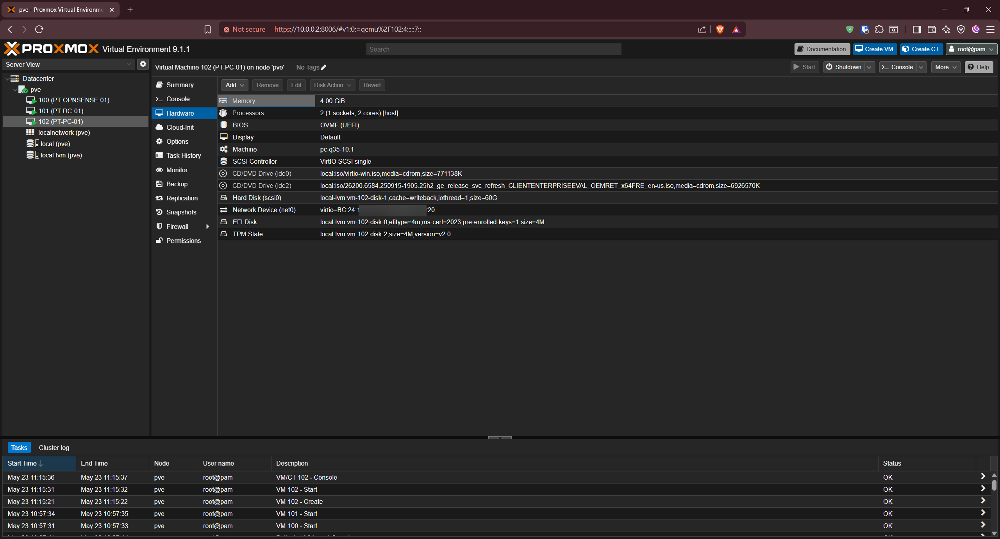
*Hardware tab: both ISOs attached, EFI disk, TPM 2.0, VirtIO SCSI disk, and VirtIO network adapter on vmbr20*

### Step 2 - Install Windows 11

Started the VM and opened the console. Booted from the Windows 11 ISO.

On the disk selection screen the 60GB virtual disk was not visible. This is expected because Windows does not include VirtIO drivers, and the VM disk uses the VirtIO SCSI controller.

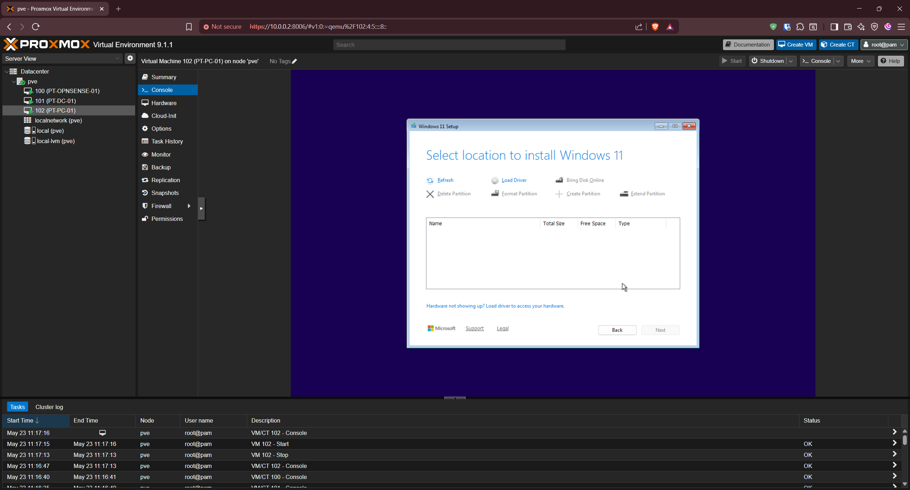
*Empty disk list: the VirtIO SCSI driver has not been loaded yet*

Used the **Load Driver** option and browsed to the virtio-win ISO at `vioscsi > w11 > amd64`. The Red Hat VirtIO SCSI pass-through controller was selected and loaded.

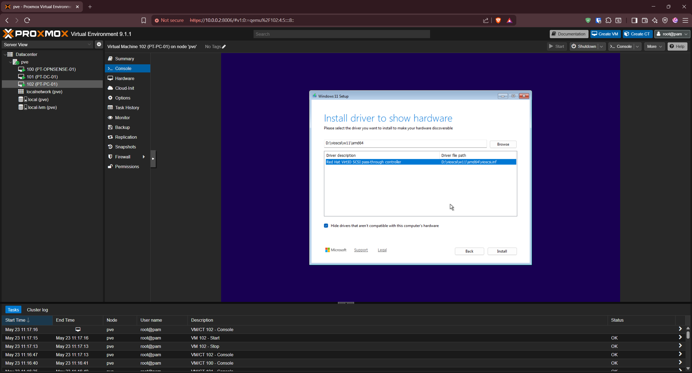
*Install driver to show hardware: Red Hat VirtIO SCSI pass-through controller at vioscsi\w11\amd64*

After loading the driver the 60GB disk appeared.

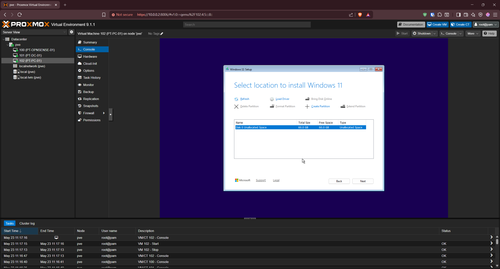
*Disk 0 Unallocated Space (60GB) visible after the VirtIO SCSI driver was loaded*

Proceeded with the installation of Windows 11 Enterprise Evaluation.

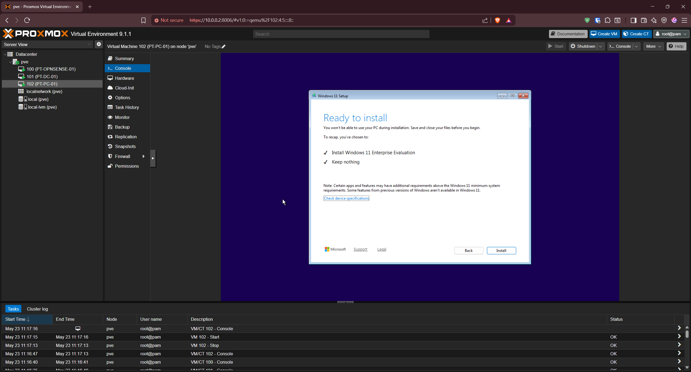
*Ready to install: Windows 11 Enterprise Evaluation, keep nothing*

### Step 3 - Create local account during OOBE

After installation completed, a local account named `localadmin` was created on the first-boot Out of Box Experience screen. This local account is kept separate from the domain accounts used later.

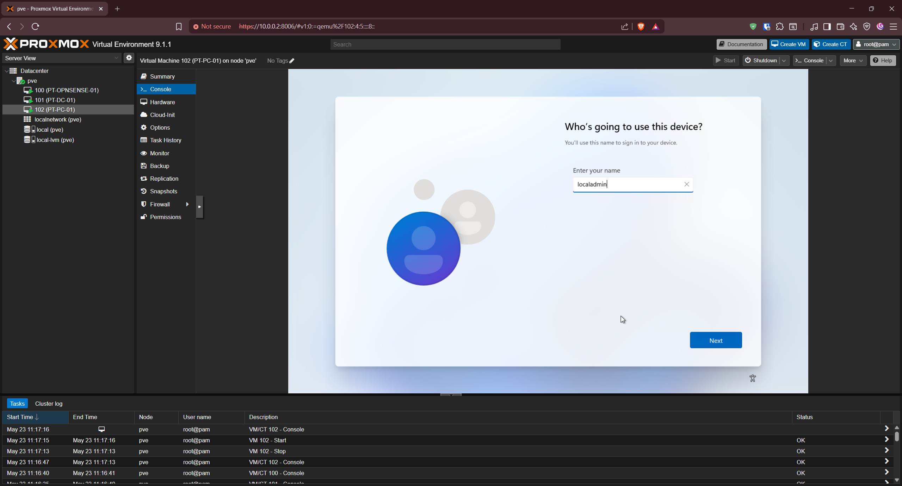
*Customize settings: local account localadmin created during OOBE*

After OOBE completed, the desktop loaded.

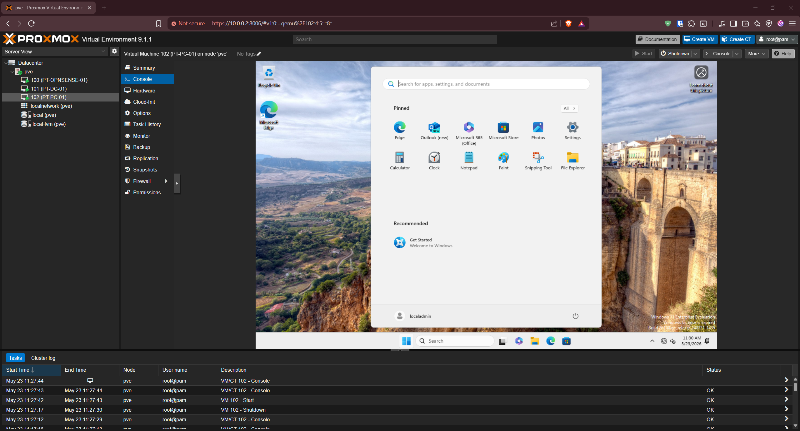
*Windows 11 desktop on first login as localadmin*

> Note: the bottom-right corner shows "Windows 11 Enterprise Evaluation - Windows License is expired/valid for 90 days." This is normal for an evaluation ISO and does not affect lab functionality.

### Step 4 - Install VirtIO drivers and guest agent

The network adapter was not present after installation. This is the same VirtIO driver situation as the storage controller. Ran `virtio-win-gt-x64.msi` from the virtio-win CD drive to install the full VirtIO driver set, including the network driver and the QEMU Guest Agent.

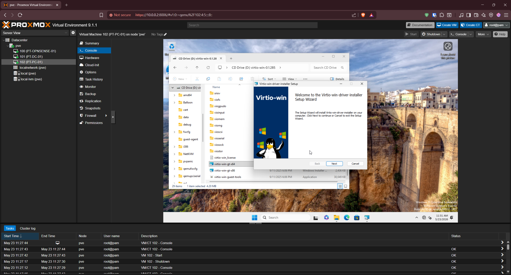
*Virtio-win-driver-installer setup wizard launched from the virtio-win CD drive*

After installation the Red Hat VirtIO Ethernet Adapter appeared and received a DHCP address.

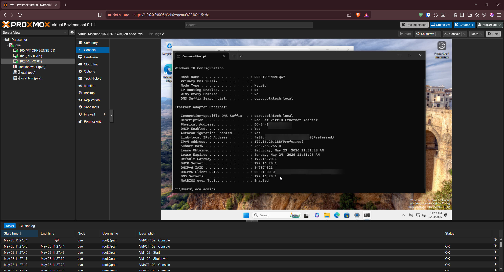
*ipconfig /all: 172.16.20.188 via DHCP from OPNsense, DNS suffix corp.polktech.local already supplied via DHCP*

### Step 5 - Set DNS to the domain controller

Opened the IPv4 properties of the network adapter and set DNS manually while leaving IP assignment on DHCP.

| Setting | Value |
|---|---|
| IP assignment | Obtain automatically (DHCP) |
| Preferred DNS | 172.16.10.10 (PT-DC-01) |
| Alternate DNS | 1.1.1.1 (Cloudflare) |

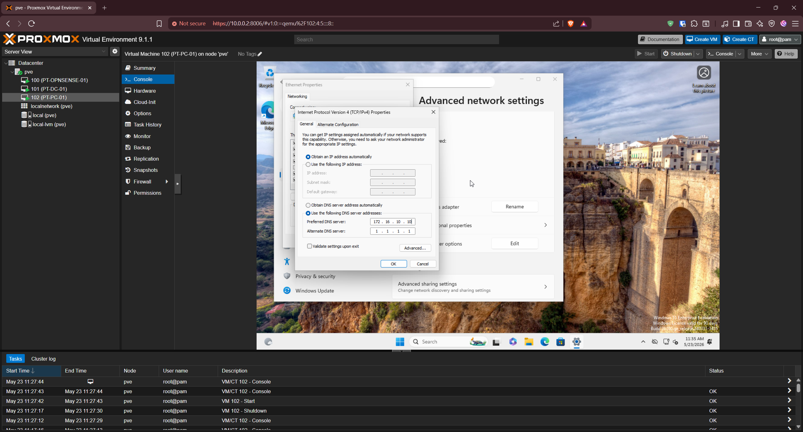
*IPv4 properties: DHCP for IP, manual DNS set to 172.16.10.10 and 1.1.1.1*

### Step 6 - Rename the computer

Renamed the workstation to `PT-PC-01` before joining the domain, then restarted.

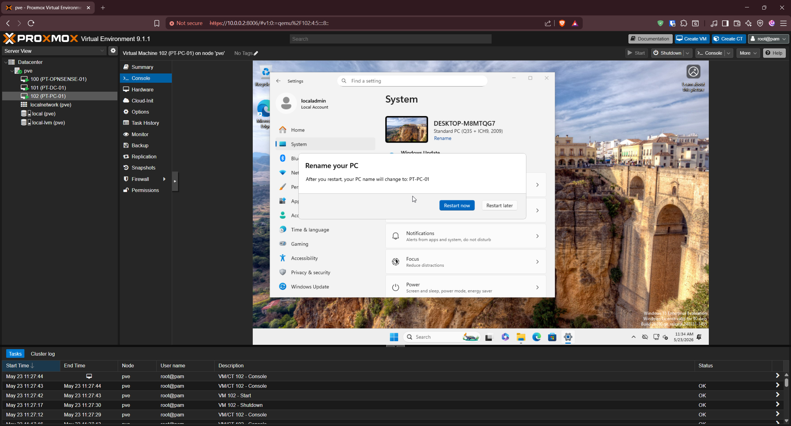
*Rename your PC: hostname set to PT-PC-01 before domain join*

### Step 7 - Join the domain

After the restart, navigated to **Settings > Accounts > Access work or school > Join a domain** and entered `corp.polktech.local`. Authenticated with the domain Administrator account when prompted.

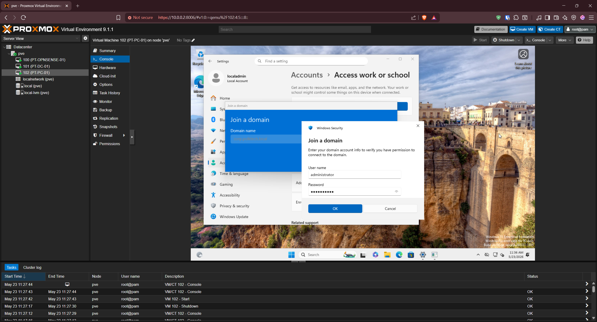
*Join a domain: corp.polktech.local with domain Administrator credentials*

The domain join succeeded and prompted for a restart.

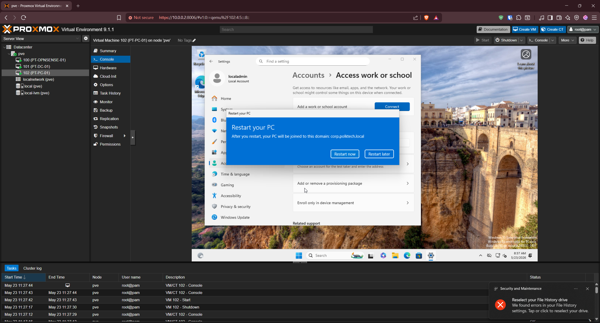
*Restart your PC: "your PC will be joined to this domain: corp.polktech.local"*

After the restart, the login screen showed the domain account `POLKTECH\administrator`, confirming the workstation was now part of the domain.

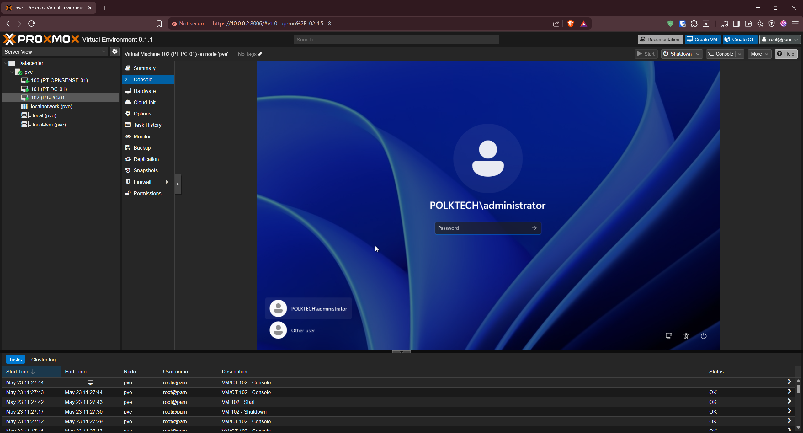
*Login screen showing POLKTECH\administrator, confirming the workstation joined the domain*

---

## Validation

Logged in as `POLKTECH\administrator` and verified the domain join.

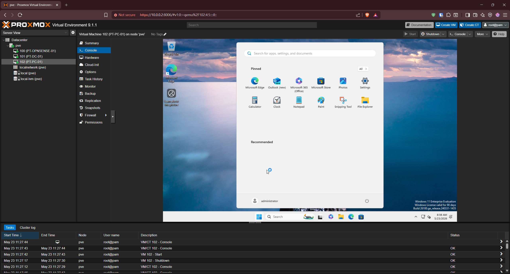
*Desktop logged in as the domain administrator account*

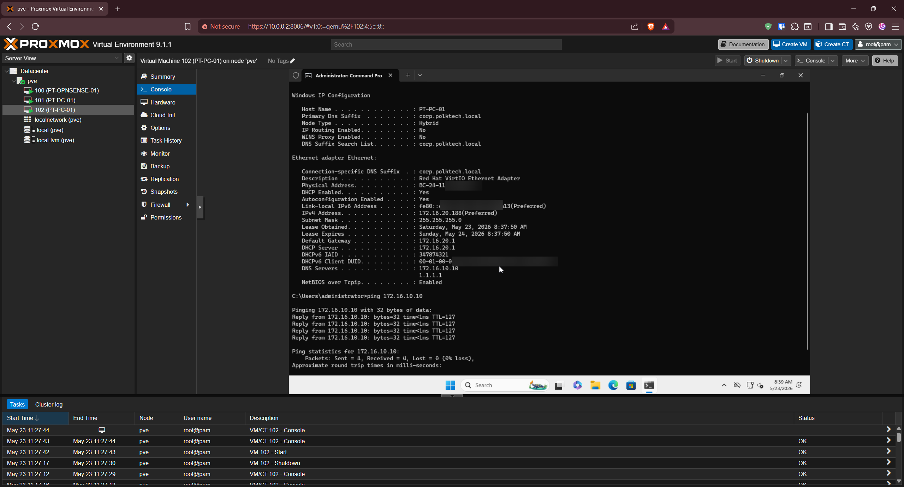
*ipconfig /all: Host Name PT-PC-01, Primary DNS Suffix corp.polktech.local, DNS 172.16.10.10; ping to PT-DC-01 (172.16.10.10) with 0% packet loss*

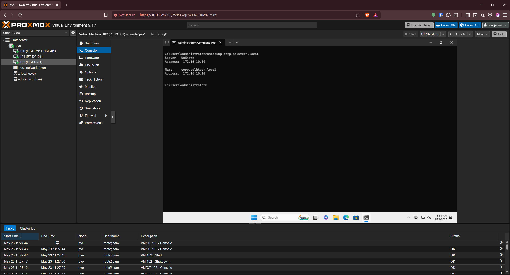
*nslookup corp.polktech.local resolves to 172.16.10.10 through PT-DC-01*

**All validation checks passed:**

- [x] PT-PC-01 receiving DHCP from OPNsense: 172.16.20.188
- [x] DNS pointed to PT-DC-01 (172.16.10.10)
- [x] Host Name shows PT-PC-01 in ipconfig /all
- [x] Primary DNS Suffix shows corp.polktech.local
- [x] Ping to PT-DC-01 (172.16.10.10) with 0% packet loss
- [x] nslookup corp.polktech.local resolves to 172.16.10.10
- [x] PT-PC-01 successfully joined corp.polktech.local
- [x] Domain Administrator login confirmed

---

## Creating and Testing a Standard Domain User

A standard (non-administrator) domain user was created to confirm that ordinary users can authenticate and log in to the workstation.

On PT-DC-01, opened **Active Directory Users and Computers** and created a new user in the Users container.

| Field | Value |
|---|---|
| Full name | Kerron Polk |
| User logon name | kpolk |
| Password | (set per lab standard, not committed) |
| Password never expires | Checked |
| User must change password at next logon | Unchecked |

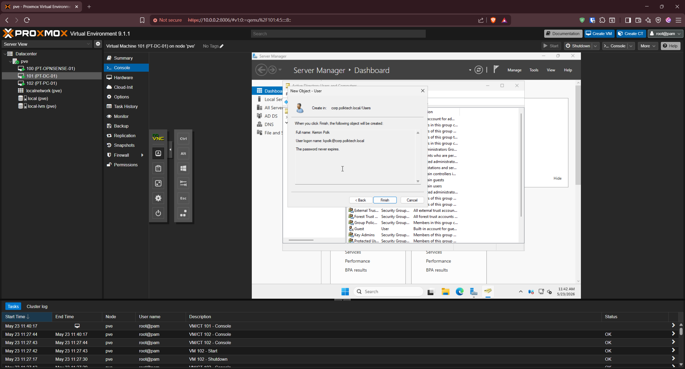
*New Object - User confirmation: Kerron Polk, kpolk@corp.polktech.local, password never expires*

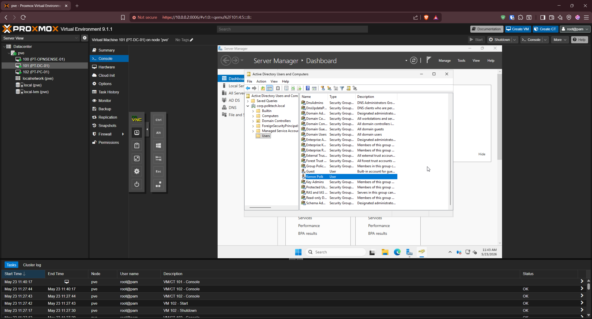
*Active Directory Users and Computers: Kerron Polk listed as a User in the corp.polktech.local Users container*

Switched back to PT-PC-01, signed out of the administrator account, and logged in as `POLKTECH\kpolk`. The standard user login succeeded.

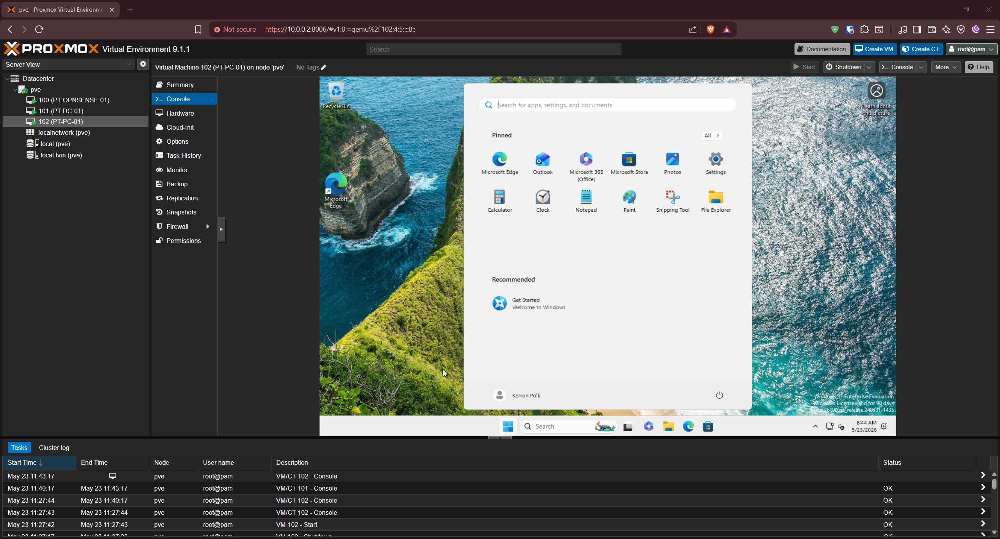
*Desktop on PT-PC-01 logged in as the standard domain user Kerron Polk*

This confirms the full authentication path: a standard domain user account created on PT-DC-01 (VLAN 10) successfully authenticating and logging into PT-PC-01 (VLAN 20) across the OPNsense-routed network.

---

## Troubleshooting Notes

**Problem:** Virtual disk not visible during Windows 11 installation

**Cause:** Windows does not include VirtIO drivers. The VM disk uses the VirtIO SCSI controller, which is invisible to the Windows installer until the driver is loaded.

**Resolution:** Used the Load Driver option during installation and loaded the VirtIO SCSI driver from the virtio-win ISO at `vioscsi > w11 > amd64`. The 60GB disk appeared immediately after the driver loaded.

---

**Problem:** Network adapter not present after installation

**Cause:** Same VirtIO driver situation as the storage controller. The network adapter uses the VirtIO NIC, which requires the NetKVM driver.

**Resolution:** Ran `virtio-win-gt-x64.msi` from the virtio-win CD drive to install the full VirtIO driver set, including the network driver and the QEMU Guest Agent.

---

## What I Learned

- Windows 11 requires UEFI, Secure Boot, and TPM 2.0; the Q35 machine type with OVMF and a TPM device satisfies these requirements in Proxmox
- A workstation must have its DNS pointed at the domain controller before it can locate or join the domain, even when the IP address comes from DHCP
- OPNsense supplies the domain suffix (corp.polktech.local) to DHCP clients automatically via DHCP option 15, which is why the suffix appeared before the domain join
- A computer should be renamed before joining the domain to avoid duplicate or stale computer objects in Active Directory
- Domain authentication routes across VLANs through OPNsense, so a successful login from a VLAN 20 workstation against a VLAN 10 domain controller confirms both the AD configuration and the inter-VLAN routing are correct
- Keeping a separate local account (localadmin) alongside domain accounts mirrors real-world practice for break-glass and offline access

---

## Real-World IT Relevance

Joining a workstation to a domain is one of the most common tasks in day-to-day IT support and desktop administration. Help desk and desktop support technicians do this constantly when provisioning new machines, re-imaging existing ones, or troubleshooting authentication problems. Understanding the dependency between DNS and domain join, why a machine must point at the domain controller for DNS, and how to verify connectivity with ipconfig, ping, and nslookup are core skills tested in CompTIA A+ and Network+ and expected in any Windows support role.

Creating standard user accounts and confirming they can log in is the everyday work of identity and access management in a Windows environment. The end-to-end test in this phase, a standard user on one VLAN authenticating to a workstation on another, demonstrates that the entire Active Directory and network design is functioning as intended.

---

## Future Improvements

- Create an Organizational Unit structure to separate users, workstations, and servers rather than using the default Users container
- Apply Group Policy Objects to the workstation in a later phase
- Migrate DHCP from OPNsense Dnsmasq to Windows Server DHCP on PT-DC-01, with OPNsense acting as a DHCP relay for VLAN 20
- Add a file share on a dedicated file server and test access from the domain user account

---

## Next Phase

[Phase 5 - Group Policy](../phase-5-group-policy/)
