# Phase 5 - Group Policy
## PolkTech SOHO Active Directory Homelab

---

## Objective

Build an Organizational Unit structure in Active Directory, create a domain file share, and deploy six Group Policy Objects to centrally manage the PolkTech workstation and its users. This phase moves the lab from a working domain into a managed domain, where security baselines, user restrictions, and standardized settings are enforced from a single point rather than configured machine by machine. Every OU-linked policy is validated on the live client PT-PC-01.

---

## Environment

| Component | Details |
|---|---|
| Domain Controller | PT-DC-01 (172.16.10.10, VLAN 10) |
| Client Workstation | PT-PC-01 (172.16.20.188, VLAN 20) |
| Domain | corp.polktech.local |
| NetBIOS Name | POLKTECH |
| Standard Test User | POLKTECH\kpolk (Kerron Polk) |
| Management Console | Group Policy Management (gpmc.msc) on PT-DC-01 |
| File Share Path | C:\Shares\PolkTech on PT-DC-01 |
| Share UNC | \\PT-DC-01\PolkTech |

> All Group Policy work is performed on PT-DC-01 and validated by logging into PT-PC-01 as the standard domain user kpolk.

---

## Tools and Technologies

- Active Directory Users and Computers (OU structure and object placement)
- Group Policy Management Console (GPMC)
- Group Policy Management Editor
- Group Policy Preferences (Drive Maps)
- Windows file sharing (share permissions and NTFS permissions)
- Sysinternals BGInfo (desktop system information display)
- `gpupdate` and `gpresult` for client-side validation

---

## OU Structure Design

Rather than leaving users and computers in the default containers, a dedicated Organizational Unit tree was built under the domain. OUs are the unit Group Policy targets, so a clean structure is what makes scoped policy possible.

```
corp.polktech.local
+-- Domain Controllers        (PT-DC-01 - left in place, never moved)
+-- PolkTech
    +-- Workstations          (PT-PC-01)
    +-- Servers
    +-- Users                 (kpolk)
    +-- Groups
```

| Object | Location | Reason |
|---|---|---|
| PT-DC-01 | Domain Controllers (default) | Domain controllers must never be moved out of this OU |
| PT-PC-01 | PolkTech > Workstations | Targets computer-scoped policy at workstations |
| kpolk | PolkTech > Users | Targets user-scoped policy at standard users |


*PolkTech OU containing Workstations, Servers, Users, and Groups sub-OUs*

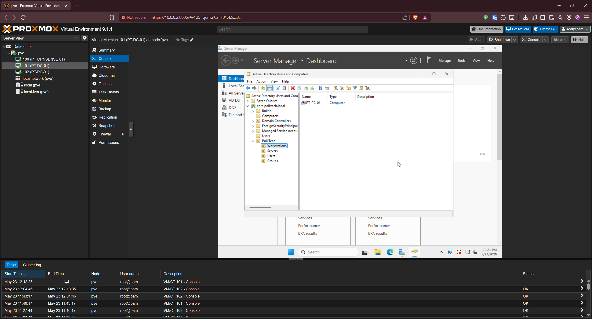
*PT-PC-01 relocated from the default Computers container into PolkTech > Workstations*

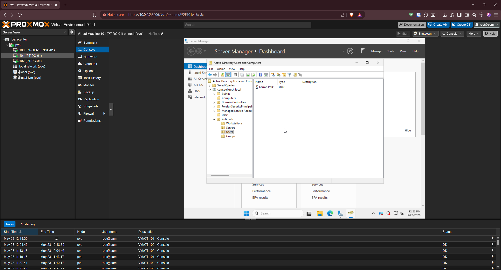
*kpolk relocated into PolkTech > Users*

---

## Creating the File Share

A shared folder was created on PT-DC-01 to back the mapped network drive deployed later in this phase.

| Item | Value |
|---|---|
| Folder path | C:\Shares\PolkTech |
| Share name | PolkTech |
| UNC path | \\PT-DC-01\PolkTech |
| Share permission | Domain Users - Read |
| NTFS permission | Domain Users - Read & Execute |

The default `Everyone` entry was removed from the share permissions, leaving only Domain Users. Access control is then handled by the combination of share and NTFS permissions.

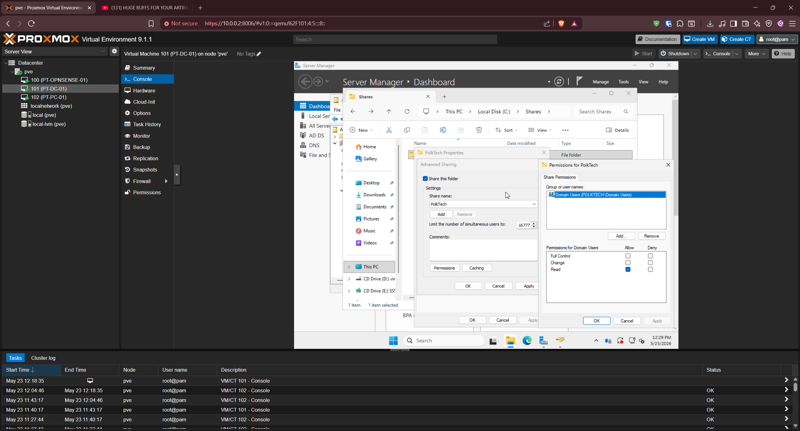
*Advanced Sharing: share named PolkTech, Everyone removed, Domain Users granted Read*

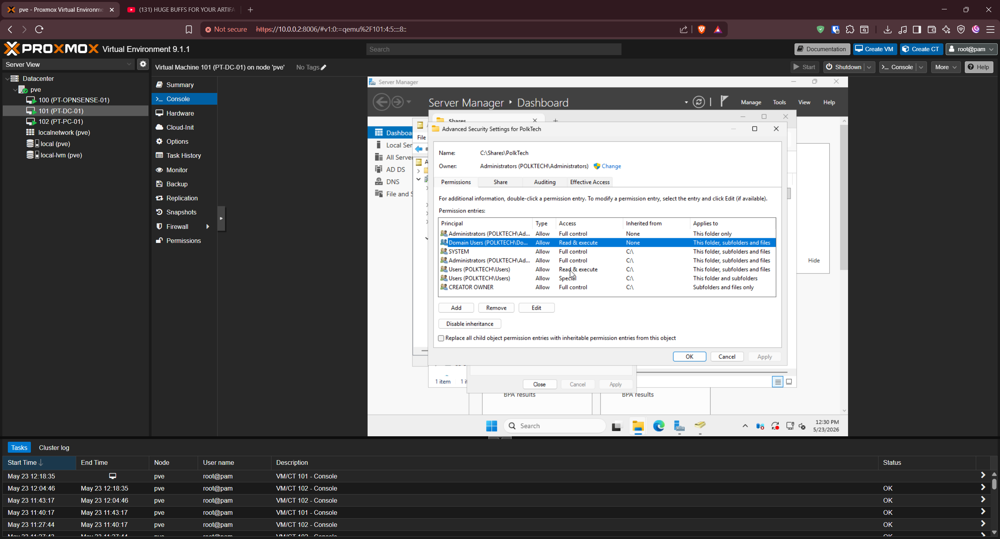
*Advanced Security Settings: Domain Users granted Read & Execute on this folder, subfolders, and files*

> Windows evaluates share permissions and NTFS permissions together, and the most restrictive of the two wins. Share permission Read combined with NTFS Read & Execute produces an effective access of Read, which is the intended access for the mapped drive.

---

## Group Policy Objects Deployed

Six GPOs were created in this phase. Two are linked at the domain root because password and account lockout policy must apply domain-wide, and four are linked to PolkTech OUs to scope them to workstations or users.

| # | GPO | Scope / Link | Purpose |
|---|---|---|---|
| 1 | Default Domain Policy (Password) | Domain root | Enforce strong password rules |
| 2 | Default Domain Policy (Account Lockout) | Domain root | Lock accounts after failed logons |
| 3 | Workstation Login Banner | PolkTech > Workstations | Display legal use notice before logon |
| 4 | Mapped Network Drive | PolkTech > Users | Map drive S: to the PolkTech share |
| 5 | Disable Control Panel | PolkTech > Users | Block Control Panel and Settings for standard users |
| 6 | Desktop Info Display | PolkTech > Users | Show live system info on the desktop via BGInfo |

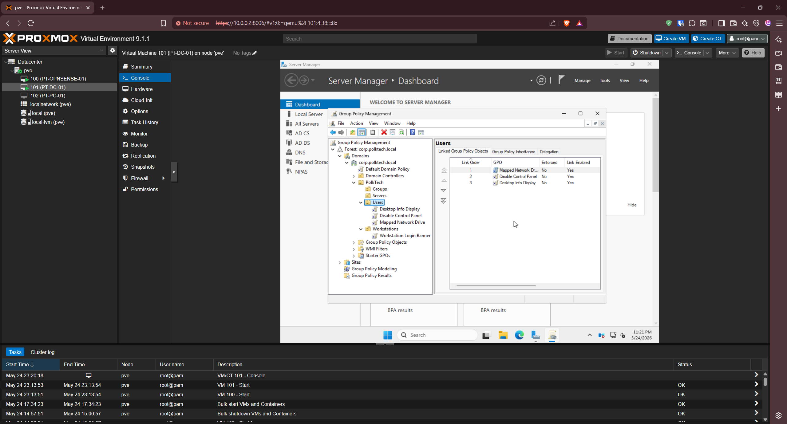
*Three user-scoped GPOs linked to PolkTech > Users: Mapped Network Drive, Disable Control Panel, and Desktop Info Display*

### GPO 1 - Password Policy

Edited in the Default Domain Policy under Computer Configuration > Policies > Windows Settings > Security Settings > Account Policies > Password Policy.

| Setting | Value |
|---|---|
| Enforce password history | 5 passwords remembered |
| Maximum password age | 90 days |
| Minimum password age | 1 day |
| Minimum password length | 12 characters |
| Password must meet complexity requirements | Enabled |

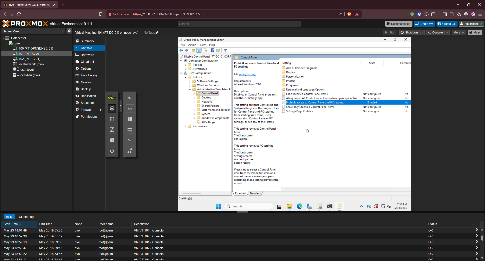
*Password Policy configured in the Default Domain Policy*

> Minimum password age of 1 day prevents a user from immediately cycling through five password changes to defeat the password history requirement. The settings are designed to work together.

### GPO 2 - Account Lockout Policy

Edited in the Default Domain Policy under Account Policies > Account Lockout Policy.

| Setting | Value |
|---|---|
| Account lockout threshold | 5 invalid logon attempts |
| Account lockout duration | 15 minutes |
| Reset account lockout counter after | 15 minutes |

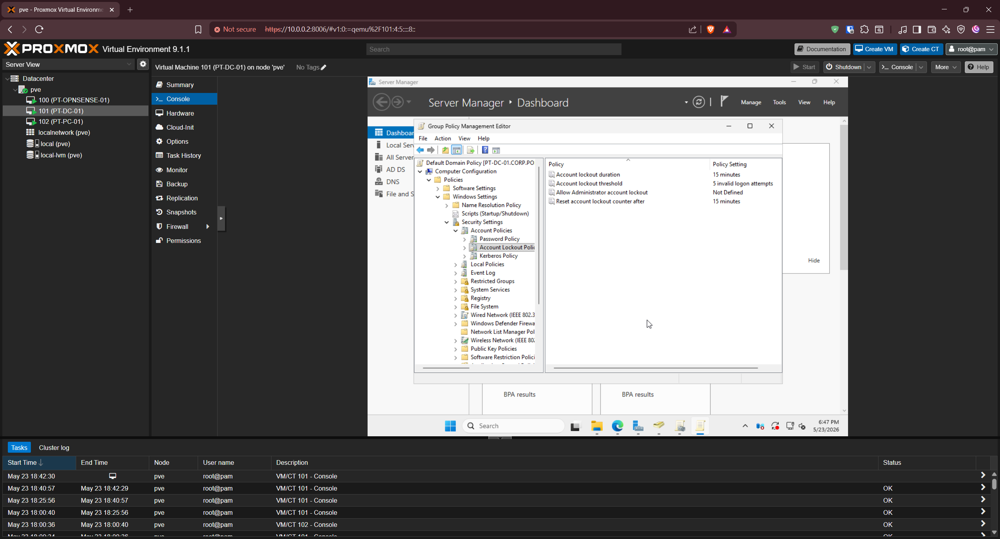
*Account Lockout Policy configured in the Default Domain Policy*

> Password and account lockout policy must be set at the domain root in a standard Active Directory design. A password policy linked to an OU will not apply unless Fine-Grained Password Policies are used. This is why both were edited in the Default Domain Policy rather than a new OU-linked GPO.

### GPO 3 - Workstation Login Banner

A new GPO linked to PolkTech > Workstations. Edited under Computer Configuration > Policies > Windows Settings > Security Settings > Local Policies > Security Options.

| Setting | Value |
|---|---|
| Interactive logon: Message title for users attempting to log on | PolkTech Authorized Use Only |
| Interactive logon: Message text for users attempting to log on | Legal use and no-expectation-of-privacy notice |

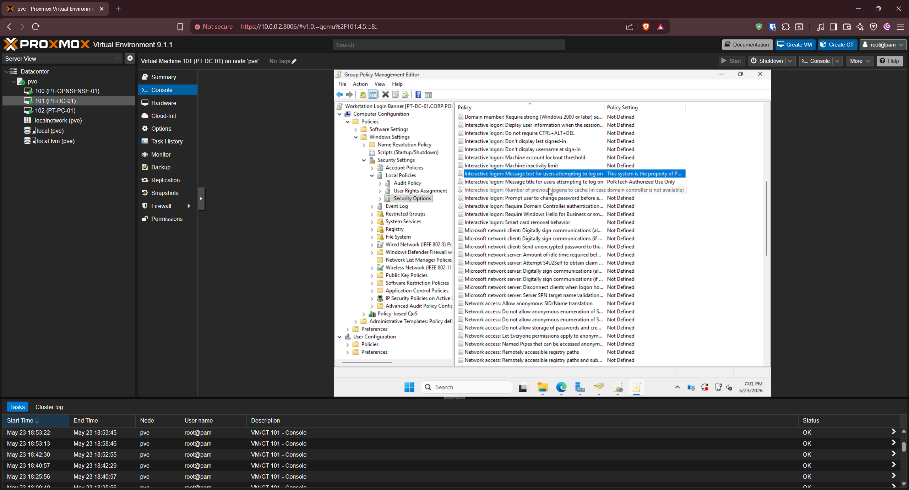
*Message title and message text configured in the Workstation Login Banner GPO*

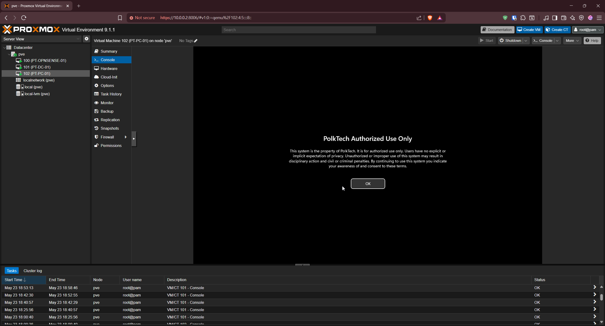
*The banner displayed on PT-PC-01 before logon, confirming the GPO applied*

> A legal logon banner is a documented requirement in several security frameworks, including CIS Controls and DISA STIGs. Presenting a no-expectation-of-privacy notice before authentication is what gives an organization the standing to monitor its systems.

### GPO 4 - Mapped Network Drive

A new GPO linked to PolkTech > Users. Configured under User Configuration > Preferences > Windows Settings > Drive Maps.

| Field | Value |
|---|---|
| Action | Create |
| Location | \\PT-DC-01\PolkTech |
| Drive Letter | S: |
| Label | PolkTech |
| Reconnect | Enabled |

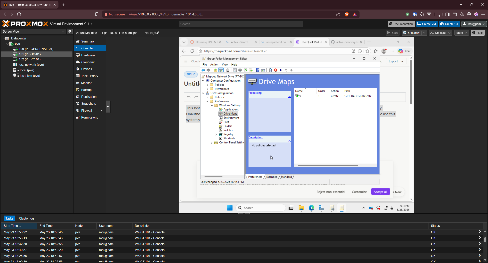
*Drive Maps preference creating drive S: mapped to \\PT-DC-01\PolkTech*

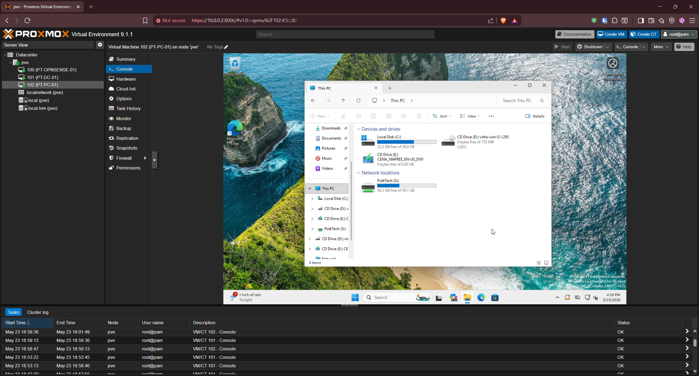
*PolkTech (S:) appears under Network locations in File Explorer on PT-PC-01*

> Mapping drives through Group Policy Preferences replaced the older logon-script net use method. Preferences support item-level targeting, require no scripting, and refresh on each policy update.

### GPO 5 - Disable Control Panel

A new GPO linked to PolkTech > Users. Configured under User Configuration > Policies > Administrative Templates > Control Panel.

| Setting | Value |
|---|---|
| Prohibit access to Control Panel and PC settings | Enabled |

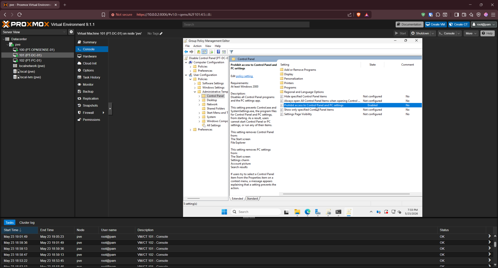
*Prohibit access to Control Panel and PC settings set to Enabled*

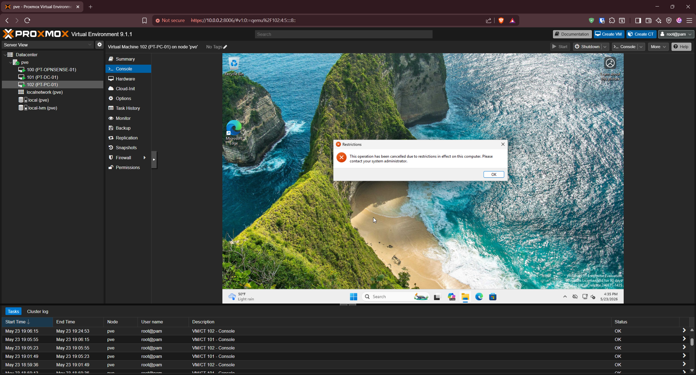
*Restrictions dialog on PT-PC-01 when kpolk attempts to open Control Panel, confirming the block*

> This single setting blocks both the classic Control Panel (Control.exe) and the modern Settings app (SystemSettings.exe). It is a least-privilege control: standard users should not be changing system settings, and disabling Control Panel enforces a ticket-based change workflow where users request changes through IT. Administrators are unaffected, and settings that need to apply broadly are pushed centrally through Group Policy.

### GPO 6 - Desktop Info Display (BGInfo)

A new GPO linked to PolkTech > Users that runs Sysinternals BGInfo at logon to render live system information onto the desktop. The BGInfo executable and a saved configuration file were staged in the NETLOGON share, which replicates automatically and is readable by all Domain Users.

Configured under User Configuration > Policies > Windows Settings > Scripts (Logon/Logoff) > Logon.

| Field | Value |
|---|---|
| Script Name | \\PT-DC-01\NETLOGON\Bginfo64.exe |
| Script Parameters | \\PT-DC-01\NETLOGON\polktech.bgi /timer:0 /nolicprompt /silent |

The BGInfo configuration displays Computer name, IP Address, Default Gateway, User Name, Domain, and OS Version.

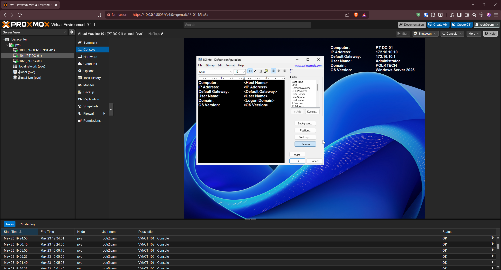
*BGInfo field layout: Computer, IP Address, Default Gateway, User Name, Domain, OS Version*

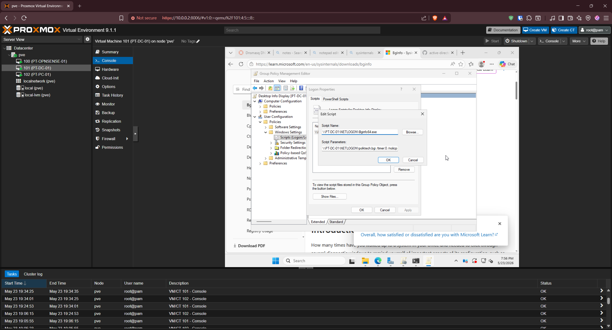
*Logon script entry pointing at Bginfo64.exe in NETLOGON with the config file and silent flags as parameters*

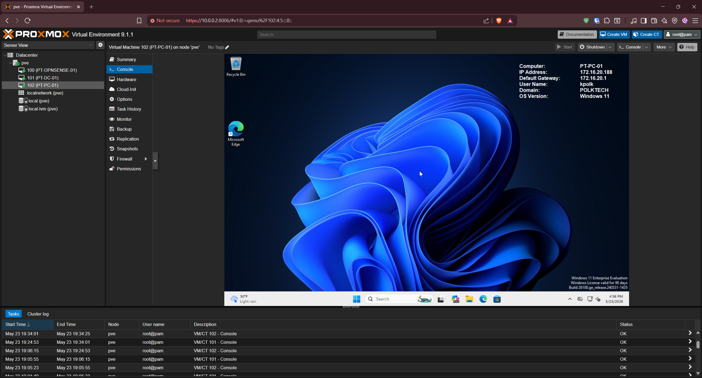
*PT-PC-01 desktop as kpolk showing the live BGInfo banner: PT-PC-01, 172.16.20.188, gateway 172.16.20.1, kpolk, POLKTECH, Windows 11*

> Deploying Sysinternals tools through a Group Policy logon script is a standard distribution technique. Showing host name, IP, and domain on every desktop lets help desk and sysadmin staff identify a machine at a glance during a remote session without asking the user to run ipconfig.

---

## Validation

The two domain-root policies were configured and confirmed applied at the domain level. The four OU-linked GPOs were each validated directly on the client by running `gpupdate /force` on PT-PC-01 and logging in as the standard domain user kpolk.

**All validation checks passed:**

- [x] PolkTech OU structure created with Workstations, Servers, Users, and Groups
- [x] PT-PC-01 moved into PolkTech > Workstations
- [x] kpolk moved into PolkTech > Users
- [x] PT-DC-01 left in the Domain Controllers OU
- [x] PolkTech file share created at \\PT-DC-01\PolkTech with Domain Users granted Read
- [x] Password and account lockout policy configured at the domain root
- [x] Login banner displayed before logon on PT-PC-01
- [x] Drive S: mapped to \\PT-DC-01\PolkTech and visible in File Explorer
- [x] Control Panel and Settings blocked for kpolk with the Restrictions message
- [x] BGInfo banner displayed live system information on the kpolk desktop

---

## Troubleshooting Notes

**Problem:** The `Everyone` group appeared in the share permissions by default.

**Cause:** Windows automatically adds `Everyone` with Read access when a folder is first shared through Advanced Sharing.

**Resolution:** Removed the `Everyone` entry and left only Domain Users with Read. This tightens the share to authenticated domain accounts and produces a cleaner, more intentional permission set.

---

**Problem:** Deciding whether password and lockout policy should be a new GPO or an edit to an existing one.

**Cause:** In a standard Active Directory domain, only one password and account lockout policy applies per domain, and it must be linked at the domain root. A new GPO linked to an OU would not enforce these settings.

**Resolution:** Edited the existing Default Domain Policy at the domain root for both password and account lockout settings rather than creating separate OU-linked GPOs.

---

## What I Learned

- Organizational Units, not the default containers, are what Group Policy targets, so a deliberate OU structure is the foundation for any scoped policy
- Domain controllers must remain in the Domain Controllers OU and should never be moved
- Password and account lockout policy must be linked at the domain root; an OU-linked password policy silently fails to apply unless Fine-Grained Password Policies are used
- Computer Configuration policies follow the machine and User Configuration policies follow the user, which determines whether a GPO is linked to the Workstations OU or the Users OU
- Share permissions and NTFS permissions are evaluated together and the most restrictive wins, so both layers must be considered when planning access
- Group Policy Preferences are the modern way to map drives, replacing logon-script net use commands
- Disabling Control Panel enforces a ticket-based change workflow for standard users while leaving administrators and central GPO management unaffected
- Sysinternals tools can be deployed cleanly through a logon script staged in NETLOGON, which replicates and is readable by all Domain Users

---

## Real-World IT Relevance

Group Policy is the core management layer of a Windows domain and one of the most important skill areas for any Windows administrator or help desk technician. Almost every enterprise enforces password and lockout baselines, legal logon banners, mapped drives, and desktop restrictions through Group Policy rather than touching machines individually. Understanding OU design, the difference between computer and user policy scope, and where a given setting must be linked is exactly what separates someone who can follow a tutorial from someone who can operate a real domain.

The file share and mapped drive in this phase represent the everyday way users access company data, and the permission model behind it is a constant source of help desk tickets in the field. The Control Panel restriction demonstrates least-privilege thinking and the ticket-based change workflow that underpins real IT operations. Validating each policy on a live client, rather than assuming the configuration worked, mirrors the verification step a competent administrator performs after any change.

---

## Future Improvements

- Test password and lockout enforcement directly by attempting a non-compliant password and triggering a lockout with repeated failed logons
- Add a dedicated file server (PT-FS-01) and move the PolkTech share off the domain controller
- Use security groups in the Groups OU to assign share and drive access by group membership rather than to all Domain Users
- Apply item-level targeting to the mapped drive so different departments receive different drives
- Build a more granular Control Panel policy using "Show only specified Control Panel items" to allow limited self-service where appropriate

---

## Next Phase

[Phase 6 - DHCP Migration](../phase-6-dhcp-migration/)
